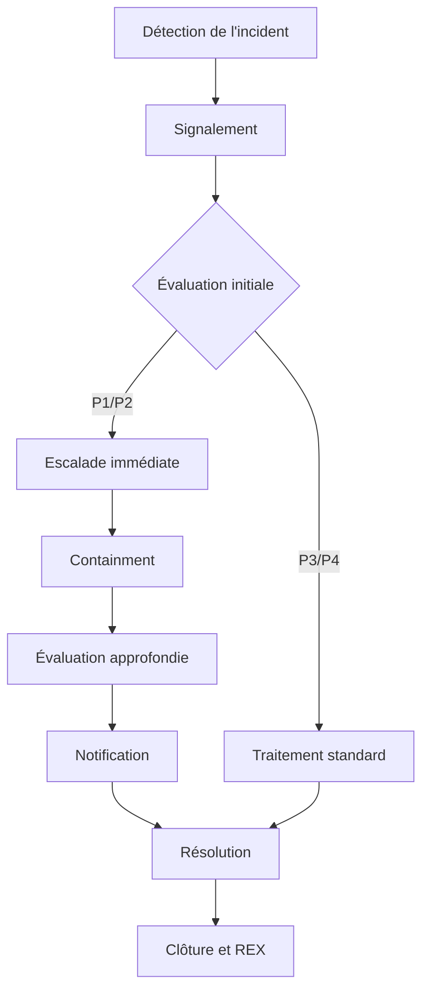

# Plan de Réponse aux Incidents (PRI) - Modèle PME e-Santé

> Ce document est une entrée, pas un audit. Il est conçu pour donner une vision claire aux responsables de PME sans expertise juridique d'un plan de réponse aux incidents ISO 27001:2022, des informations concernées et des actions prioritaires à mener.  

> C'est un modèle générique, aligné sur:
> - ISO 27001:2022 (A.5.24, A.5.25, A.5.26, A.5.27, A.5.30).
> - RGPD (Art. 33-34 : Notification des violations).
> - HDS (R. 1112-7 : Gestion des incidents de sécurité).
> - NIS2 : Art. 21 (Mesures de gestion des risques et de sécurité des réseaux), Art. 23 (Notification des incidents).

## Objectifs

- Répondre rapidement aux incidents de sécurité grâce à des processus formalisés de réponse aux incidents.
- Respecter les délais légaux (RGPD : 72h, HDS : 24h pour les incidents critiques).
- Améliorer en continu la posture de sécurité via des REX (Retours d’Expérience).
- Sensibiliser les employés à la détection et au signalement.

## Comment l’utiliser ?

- Personnalisez les sections (ex : noms, emails, outils).
- Ajoutez/supprimez des playbooks en fonction de vos risques spécifiques (ex : si vous n’utilisez pas Stripe, retirez le playbook lié).
- Testez le PRI via des exercices (ex : simulation de phishing).
- Réviser le document trimestriellement (ou après chaque incident critique).
- Archiver les anciennes versions dans un dossier /archives/.

---

## **Sommaire**

0. [Personnalisation Rapide](#personnalisation-rapide)
1. [Définitions et Classification](#1-définitions-et-classification)
   - [1.1. Définitions et Classification des Incidents](#11-définitions-et-classification-des-incidents)
   - [1.2. Rôles et Responsabilités](#12-rôles-et-responsabilités)
2. [Canaux de Signalement](#2-canaux-de-signalement)
3. [Procédure Générale de Réponse aux Incidents](#3-procédure-générale-de-réponse-aux-incidents)
   - [3.1. Revue de Direction et Amélioration Continue](#31-revue-de-direction-et-amélioration-continue)
   - [3.2. Processus Global de Réponse aux Incidents](#32-processus-global-de-réponse-aux-incidents)
   - [3.3. Playbooks pour Incidents Courants](#33-playbooks-pour-incidents-courants)
   - [3.4. Revue Trimestrielle](#34-revue-trimestrielle)
   - [3.5. Exercices et Tests](#35-exercices-et-tests)
4. [Historique des Révisions](#4-historique-des-révisions)
5. [Annexes](#5-annexes)
   - [5.1. Tableau des Obligations par Réglementation](#51-tableau-des-obligations-par-réglementation)
   - [5.2. Registre des Incidents](#52-registre-des-incidents)
   - [5.3. Retour d’Expérience (REX)](#53-retour-d’expérience-rex)

----

## Personnalisation Rapide
(À compléter avant utilisation)

| Champ | Valeur par Défaut (SantéConnect) | Votre Valeur |
| --- | --- | --- |
| Nom de l’entreprise | SantéConnect | [Votre nom] |
| RSSI | Claire ESPINOZA | [Nom] |
| Email RSSI | [claire.espinoza@santeconnect-demo.fr](mailto:claire.espinoza@santeconnect-demo.fr) | [Email] |
| DevOps | Stéphane ROY | [Nom] |
| DPO | Jeanne PETIT | [Nom] |
| CEO | Martin DUPONT | [Nom] |
| RH | Bernard THOMAS | [Nom] |
| Email Incidents | [incident@santeconnect-demo.fr](mailto:incident@santeconnect-demo.fr) | [Email] |
| Ligne Téléphonique | +33 1 23 45 67 89 | [Numéro] |
| Outil de Logging | Graylog | [Outil] |
| Outil EDR | Wazuh | [Outil] |
| Outil WAF | Cloudflare | [Outil] |
| Fournisseur Cloud | OVH | [Fournisseur] |

---

## 1. Définitions et Classification

### 1.1. Définitions et Classification des Incidents
(À adapter selon vos risques métiers)

| Niveau | Sévérité | Description | Exemples | Délai de Réaction | Délai de Notification | Responsable |
| --- | --- | --- | --- | --- | --- | --- |
| P1 | 🔴 Critique | Violation avérée de données sensibles (PII, santé) ou impact opérationnel majeur. | Ransomware, fuite de données médicales, accès non autorisé à un système critique. | < 1h | 24h (HDS) / 72h (RGPD) | RSSI |
| P2 | ⚠️ Élevée | Incident avec impact potentiel sur les données ou les services. | Phishing réussi, vulnérabilité critique non patchée, tentative de fraude. | < 4h | 72h (RGPD si données personnelles) | RSSI + DevOps |
| P3 | 🟡 Modérée | Incident avec impact limité ou contrôlé. | Accès non autorisé à un système non critique, malware non propagé. | < 24h | Aucune (sauf si données personnelles) | DevOps |
| P4 | 🟢 Faible | Incident sans impact direct sur les données ou les services. | Fausse alerte, tentative de force brute bloquée. | < 72h | Aucune | DevOps |

### 1.2. Rôles et Responsabilités
(À adapter selon votre organigramme)

| Rôle | Nom | Email | Téléphone | Responsabilités | Délai de Réaction |
| --- | --- | --- | --- | --- | --- |
| Responsable Incidents (RI) | [RSSI] | [Email RSSI] | [Téléphone] | Coordonner la réponse, escalader vers la direction, valider la clôture. | Immédiat (P1/P2) |
| Responsable Technique (RT) | [DevOps] | [Email DevOps] | [Téléphone] | Analyser l’incident, appliquer les correctifs techniques. | < 1h (P1), < 4h (P2) |
| Responsable Données Privées (DPO) | [DPO] | [Email DPO] | [Téléphone] | Notifier les autorités (CNIL, HDS) et les personnes concernées (RGPD Art. 34). | < 24h (P1), < 72h (P2) |
| Responsable RH | Bernard THOMAS | [Email RH] | [Téléphone] | Sensibilisation des employés (formation anti-phishing), gestion disciplinaire en cas d’incident lié à une erreur humaine. | < 24h (P2) |
| Direction | [CEO] | [Email CEO] | [Téléphone] | Valider les décisions stratégiques (ex : paiement d’une rançon, arrêt d’un service). | < 1h (P1) |
| Équipes Métiers | Tous les employés | - | - | Signaler les incidents via les canaux dédiés (Section 4). | Immédiat |

_Note :_
_- Pour une PME de 15 personnes, un même individu peut cumuler plusieurs rôles._
_- Documenter les absences : Désigner un remplaçant pour chaque rôle (ex : DevOps remplace le RSSI en son absence)._

----

## 2. Canaux de Signalement
(À adapter selon vos outils)

| Canal | Utilisation | Public Cible | Délai de Réaction | Exemple | Lien/Contact |
| --- | --- | --- | --- | --- | --- |
| Email sécurisé | Signalement d’incidents non urgents. | Tous les employés | Immédiat | Email de phishing reçu. | [incident@votre-entreprise.fr](mailto:incident@votre-entreprise.fr) |
| Formulaire Web | Signalement simple et guidé. | Tous les employés | Immédiat | Comportement suspect observé. | [https://votre-entreprise.fr/incident]  |
| Ligne téléphonique | Urgences (ex : ransomware, fuite de données). | Tous les employés | Immédiat | Appel en cas d’attaque en cours. | +33 X XX XX XX XX |
| Slack/Teams | Alertes techniques automatiques. | Équipe technique | Immédiat | Alerte depuis Graylog/Wazuh. | #incidents (canal dédié) |
| Bouton "Signaler" | Intégré dans les outils métiers. | Tous les employés | Immédiat | Bouton dans l’intranet. | À configurer dans vos outils |

**Bonnes Pratiques :**
- Afficher les canaux dans un endroit visible (ex : intranet, signature email).
- Former les employés : 1 session annuelle + rappel trimestriel.
- Garantir l’anonymat : Pas de blâme pour les signalements de bonne foi.

-----

## 3. Procédure Générale de Réponse aux Incidents
(À adapter selon vos processus internes)

### 3.1. Revue de Direction et Amélioration Continue
(Gouvernance – ISO 27001:2022, A.9.3) 
**KPIs de Suivi** 
(À adapter selon vos objectifs)  

| Indicateur | Cible | Fréquence | Responsable | Source | 2026 (Objectif) | 2026 (Réel) |
| --- | --- | --- | --- | --- | --- | --- |
| Temps moyen de détection (P1) | < 1h | Mensuel | RI | Graylog/Wazuh | < 1h | [Valeur] |
| Temps moyen de résolution (P1) | < 24h | Mensuel | RI | Registre des incidents | < 24h | [Valeur] |
| % d’incidents notifiés dans les délais | 100% | Trimestriel | DPO | Registre des incidents | 100% | [Valeur] |
| Nombre d’incidents P1/P2 | ≤ 1/mois | Trimestriel | RI | Registre des incidents | ≤ 12/an | [Valeur] |
| % de REX documentés sous 72h (P1) | 100% | Trimestriel | RI | Dossier /incidents/ | 100% | [Valeur] |

### 3.2. Processus Global de Réponse aux Incidents
(À adapter selon vos processus internes, votre contexte et les risques identifés)

**Étapes Détaillées**

| Étape | Description | Responsable | Délai | Outils/Preuves |
| --- | --- | --- | --- | --- |
| 1. Détection | Détection automatique (outils) ou manuelle (employés). | Tous | Immédiat | Graylog, Wazuh, Emails, Alertes SIEM |
| 2. Signalement | Signalement via les canaux dédiés (email, formulaire, téléphone). | Employés | Immédiat | incident@votre-entreprise.fr, Formulaire Web, Ligne 24/7 |
| 3. Évaluation initiale | Classer l’incident selon la sévérité (P1 à P4). | RI | < 15 min | Matrice de classification (Section 2) |
| 4. Escalade | Notifier les responsables selon le niveau de sévérité. | RI | < 1h (P1), < 4h (P2) | Slack, Email, Téléphone |
| 5. Containment | Limiter l’impact de l’incident. | RT | < 1h (P1), < 4h (P2) | Firewall, Isolation réseau, Désactivation de comptes |
| 6. Évaluation approfondie | Analyser la cause racine et l’impact. | RT + RI | < 4h (P1), < 24h (P2) | Logs, Rapports techniques |
| 7. Notification | Notifier la direction et les régulateurs si nécessaire. | DPO | < 24h (P1), < 72h (P2) | Templates RGPD/HDS (Section 6) |
| 8. Résolution | Appliquer les correctifs et restaurer les services. | RT | < 24h (P1), < 72h (P2) | Rapports de résolution |
| 9. Clôture et REX | Documenter l’incident et organiser un REX. | RI | < 72h (P1), < 1 semaine (P2) | Registre des incidents, Template REX |

**Processus d’Escalade Standardisé**
(Pour s’assurer que les incidents graves sont rapidement signalés à la direction et aux régulateurs)

| Niveau de Sévérité | Escalade Interne | Escalade Externe | Délai | Responsable |
| --- | --- | --- | --- | --- |
| P1 (Critique) | RI → Direction → Tous les responsables | CNIL (RGPD), ANS (HDS) | < 1h (interne), < 24h (externe) | RI + DPO |
| P2 (Élevée) | RI → RT → DPO | CNIL (si données personnelles) | < 4h (interne), < 72h (externe) | RI + DPO |
| P3 (Modérée) | RI → RT | Aucune (sauf si données personnelles) | < 24h (interne) | RI |
| P4 (Faible) | RT | Aucune | < 72h (interne) | RT |

### 3.3. Playbooks pour Incidents Courants
(À adapter selon vos risques spécifiques – Supprimez/ajoutez des playbooks)

#### Playbook 1 : Ransomware
Contexte : Détection d’un ransomware (ex : WannaCry, LockBit).

**Important :**
- ⚠️ Ne pas payer la rançon
- Risques : Pas de garantie de récupération des données, financement du crime.
- Décision : Validée par la direction (CEO).

| Étape | Action | Responsable | Outils | Délai | Preuves |
| --- | --- | --- | --- | --- | --- |
| 1 | Isoler les systèmes infectés | RT | Wazuh, Firewall | < 15 min | Logs Wazuh |
| 2 | Identifier la souche | RT | VirusTotal, NoMoreRansom | < 1h | Capture d’écran |
| 3 | Notifier la direction et la CNIL | RI + DPO | Email sécurisé | < 1h | Email envoyé |
| 4 | Restaurer depuis sauvegarde | RT | Sauvegardes OVH (A.8.13) | < 24h | Logs de restauration |
| 5 | Analyser la cause racine | RT | Logs, REX | < 72h | Rapport d’analyse |
| 6 | Mettre à jour les contrôles | RI | PTR (A.8.7, A.8.8) | < 1 semaine | Mise à jour du PTR |

#### Playbook 2 : Fuite de Données (PII/Santé)
Contexte : Fuite avérée de données personnelles ou de santé.

**A noter :** se référer à procédure des incidents et notifications RGPD si existant.

| Étape | Action | Responsable | Outils | Délai | Preuves |
| --- | --- | --- | --- | --- | --- |
| 1 | Confirmer la fuite (logs, DLP) | RT | Graylog, Wazuh | < 1h | Logs |
| 2 | Identifier les données exposées | RT + DPO | Registre des traitements | < 2h | Liste des données |
| 3 | Notifier la CNIL (RGPD Art. 33) | DPO | [Formulaire CNIL](https://www.cnil.fr/) | < 24h | Accusé de réception |
| 4 | Notifier les personnes concernées (RGPD Art. 34) | DPO | Email sécurisé | < 72h | Email envoyé |
| 5 | Corriger la vulnérabilité | RT | Patch, A.8.26 | < 48h | Logs de correctif |
| 6 | REX + Mise à jour du PTR | RI | [Registre](#52-registre-des-incidents) | < 1 semaine | Compte-rendu REX |

#### Playbook 3 : Phishing Réussi
Contexte : Un employé a cliqué sur un lien malveillant.

| Étape | Action | Responsable | Outils | Délai | Preuves |
| --- | --- | --- | --- | --- | --- |
| 1 | Bloquer l’accès du compte compromis | RT | Active Directory, MFA | < 30 min | Logs AD |
| 2 | Réinitialiser les mots de passe | RT | Script Python | < 1h | Logs de réinitialisation |
| 3 | Analyser l’email malveillant | RT | VirusTotal, Mimecast | < 2h | Rapport VirusTotal |
| 4 | Sensibiliser l’employé concerné | RH | Formation ciblée | < 24h | Email de formation |
| 5 | Mettre à jour les filtres anti-phishing | RT | A.8.7 | < 48h | Logs de mise à jour |

### 3.4. Revue Trimestrielle

A adapter aux documents de l'entreprise: Documentée dans PSSI section 3.

Livrable : PV de revue trimestrielle.

### 3.5. Exercices et Tests
(Préparation – ISO 27001:2022, A.5.30)

**Bonnes Pratiques :**  
- Documenter les résultats dans /exercices/{ANNEE}/.  
- Améliorer les playbooks après chaque exercice.  

| Type d’Exercice | Fréquence | Participants | Scénario | Objectif | Prochaine Date | Responsable |
| --- | --- | --- | --- | --- | --- | --- |
| Test de Phishing | Trimestriel | Tous les employés | Campagne simulée (ex : faux email CNIL) | Sensibilisation + Détection | 15/07/2026 | RH + DPO |
| Simulation Ransomware | Semestriel | RI + RT + Direction | Attaque simulée (ex : fichier chiffré) | Test des playbooks P1 | 30/09/2026 | RI |
| Exercice sur Table | Annuel | RI + RT + DPO + Direction | Fuite de données (PII) | Validation des procédures P1/P2 | 15/12/2026 | RI |
| Test de Notification RGPD | Annuel | DPO + Direction | Violation simulée (ex : fuite de données) | Respect des délais (72h) | 10/10/2026 | DPO |
| Test de Sauvegarde | Trimestriel | RT | Restauration depuis sauvegarde | Vérification de l’intégrité (A.8.13) | 01/08/2026 | RT |

-----

## 4. Historique des Révisions
(À mettre à jour après chaque modification)

| Version | Date | Auteur | Modifications | Approbation |
| --- | --- | --- | --- | --- |
| 1.0 | 05/06/2026 | [Votre Nom] | Création initiale du PRI. | [CEO] |
| 1.1 | [Date] | [Nom] | [Ex : Ajout du playbook "Indisponibilité d’un service critique"]. | [CEO] |

----

## 5. Annexes

Documentation liée à créer séparément, mettre à jour et archivée pour anciennces versions.

### 5.1. Tableau des Obligations par Réglementation

**Mode d'emploi :**  
- Adapter ce tableau à vos obligations réglementaires et à votre documentation existante.
- Mettre à jour ce tableau trimestriellement ou après chaque changement réglementaire.
- Cocher ✅ les actions réalisées.
- Ajouter des lignes pour les nouvelles obligations (ex : nouveau règlement européen).
- Lier chaque contrainte à votre PTR ou PRI (ex : RGPD Art. 33 → R-GOV-02).
- Archiver les anciennes versions : Conservez un historique des versions dans un dossier type /archives/contraintes-reglementaires/.

**Légende :**
| Symbole | Signification | Action Recommandée |
| --- | --- | --- |
| ✅ | Conforme | Aucune action requise. |
| ⚠️ | Partiellement conforme | Vérifier et compléter. |
| ❌ | Non conforme | Priorité absolue : Corriger immédiatement. |

| Réglementation | Article/Référence | Obligation | Périmètre | Délai | Sanction (Max) | Responsable | Actions à Mettre en Œuvre | Preuves | Lien avec le PTR/PRI | Statut |
| --- | --- | --- | --- | --- | --- | --- | --- | --- | --- | --- |
| RGPD | Art. 5 | Principes de base (licéité, finalité, minimisation) | Toutes les données personnelles | Permanent | 4% du CA ou 20M€ | DPO | Vérifier la conformité des traitements. | Registre des traitements | R-GOV-01 | ✅ |
| RGPD | Art. 24 | Responsabilité du responsable de traitement | Toutes les données personnelles | Permanent | 4% du CA ou 20M€ | DPO | Mettre en place des mesures techniques et organisationnelles. | PSSI, SoA | R-GOV-03 | ✅ |
| RGPD | Art. 28 | Contrats avec les sous-traitants | Tous les fournisseurs (OVH, Stripe, CHU) | Permanent | 4% du CA ou 20M€ | Juridique + DPO | Vérifier que tous les contrats incluent les clauses RGPD Art. 28. | [Contrats signés]  | R-GOV-03 | ✅ |
| RGPD | Art. 30 | Registre des traitements | Toutes les données personnelles | Permanent | 4% du CA ou 20M€ | DPO | Maintenir à jour le registre des traitements. | [Registre des traitements]  | R-GOV-01 | ✅ |
| RGPD | Art. 32 | Sécurité des traitements | Toutes les données personnelles | Permanent | 4% du CA ou 20M€ | RSSI | Mettre en place des mesures de sécurité (chiffrement, pseudonymisation). | SoA, PTR | R-API-01, R-DON-02 | ✅ |
| RGPD | Art. 33 | Notification des violations à la CNIL | Violation de données personnelles | 72h max | 4% du CA ou 20M€ | DPO | Notifier la CNIL sous 72h en cas de violation avérée. | Template RGPD  | R-GOV-02, PRI Section 10.1 | ✅ |
| RGPD | Art. 34 | Notification aux personnes concernées | Violation à haut risque pour les droits et libertés | Sans délai indû | 4% du CA ou 20M€ | DPO | Notifier les personnes concernées si risque élevé. | Template RGPD | R-GOV-02, PRI Section 10.2 | ✅ |
| RGPD | Art. 35 | PIA (Analyse d’Impact) | Traitements à haut risque (ex : données de santé) | Avant le traitement | 4% du CA ou 20M€ | DPO | Réaliser un PIA pour les traitements critiques. | PIA D-002  | R-GOV-01 | ⚠️ |
| HDS | R. 1111-10 | Certification HDS pour l’hébergement | Données de santé | Permanent | Sanctions administratives | RSSI | Vérifier que OVH est certifié HDS. | [Certificat HDS OVH]  | R-HDS-01 | ✅ |
| HDS | R. 1112-7 | Notification des incidents de sécurité | Incidents impactant des données de santé | 24h max | Sanctions administratives | RSSI | Notifier l’ANS sous 24h en cas d’incident critique. | Template HDS  | R-HDS-01, PRI Section 10.1 | ✅ |
| HDS | R. 1112-8 | Sécurité physique et logique | Données de santé | Permanent | Sanctions administratives | RSSI | Vérifier les accès physiques et logiques (OVH). | Audit OVH  | R-HDS-02 | ✅ |
| NIS2 | Art. 21 | Gestion des risques | Systèmes critiques (APIs, serveurs) | Permanent | Amendes (jusqu’à 10M€ ou 2% du CA) | RSSI | Mettre en place une gestion des risques (PTR). | PTR | R-API-01, R-NIS2-01 | ✅ |
| NIS2 | Art. 21 | Sécurité des systèmes | Systèmes critiques | Permanent | Amendes (jusqu’à 10M€ ou 2% du CA) | RSSI | Appliquer les contrôles de sécurité (A.8.20, A.8.21). | SoA | R-INT-01 | ✅ |
| NIS2 | Art. 21 | Gestion des vulnérabilités | Tous les systèmes | Permanent | Amendes (jusqu’à 10M€ ou 2% du CA) | DevOps | Corriger les vulnérabilités sous 30 jours. | [Rapport de vulnérabilités]  | R-ISO-02 | ⚠️ |
| NIS2 | Art. 23 | Gestion des incidents | Tous les systèmes | Permanent | Amendes (jusqu’à 10M€ ou 2% du CA) | RSSI | Mettre en place un PRI (Plan de Réponse aux Incidents). | PRI | R-NIS2-02 | ✅ |
| ISO 27001:2022 | A.5.1 | Politique de sécurité | Tous les actifs | Permanent | Audit non conforme | RSSI | Maintenir une PSSI à jour. | [PSSI]  | R-ISO-01 | ✅ |
| ISO 27001:2022 | A.5.15 | Contrôle d’accès | Tous les actifs | Permanent | Audit non conforme | RSSI | Appliquer une matrice RBAC. | [Matrice RBAC]  | R-PLAT-01 | ✅ |
| ISO 27001:2022 | A.8.16 | Activités de surveillance | Tous les systèmes | Permanent | Audit non conforme | DevOps | Surveiller les activités (Graylog, Wazuh). | [Logs Graylog]  | R-GOV-02 | ✅ |
| ISO 27001:2022 | A.8.20 | Sécurité des réseaux | Réseaux internes | Permanent | Audit non conforme | RSSI | Segmenter les réseaux (DMZ pour les APIs). | [Schéma réseau]  | R-INT-01 | ✅ |
| ISO 27001:2022 | A.8.29 | Tests de sécurité | Applications critiques | Avant mise en production | Audit non conforme | DevOps | Réaliser des tests de pénétration annuels. | [Rapport de tests]  | R-APP-01 | ⚠️ |
| ISO 27001:2022 |  A.8.15  | Enregistrement des activités | Tous les systèmes | Permanent | Audit non conforme | DevOps | Conserver les logs pendant 1 an. | [Logs Graylog]  | R-GOV-02 | ✅ |

----

### 5.2. Registre des incidents
(Traçabilité complète – ISO 27001:2022, A.8.16)

**Instructions :**  
- Mettre à jour ce tableau après chaque incident.  
- Archiver les incidents clôturés dans /incidents/{ANNÉE}/.  
- Lier chaque incident à un risque du PTR (ex : INC-2026-001 → R-DON-03).  

|  **ID**       | **Date**       | **Type**          | **Sévérité** | **Actif/Processus** | **Statut**  | **RI**            | **RT**            | **DPO **            | **Date Détection** | **Date Résolution** | **Délai de Résolution** | **Délai de Notification** | **Lien REX**          | **Lien PTR**       |
 |--------------|----------------|-------------------|--------------|---------------------|-------------|-------------------|-------------------|-------------------|---------------------|----------------------|---------------------------|-----------------------------|------------------------|---------------------|
 | INC-2026-001 | 01/06/2026     | Ransomware        | 🔴 P1        | Serveur OVH (D-002) | Clôturé     | Claire ESPINOZA   | Stéphane ROY      | Jeanne PETIT      | 01/06/2026 14:30    | 02/06/2026 10:00     | 19h30                     | 24h (HDS)               | [REX-INC-2026-001] | R-DON-03           |
 | INC-2026-002 | 02/06/2026     | Phishing          | ⚠️ P2        | Email (T-003)       | Clôturé     | Claire ESPINOZA   | Stéphane ROY      | -                 | 02/06/2026 09:15    | 02/06/2026 11:00     | 1h45                      | Aucune                     | [REX-INC-2026-002] | R-DON-01           |
 | INC-2026-003 | 03/06/2026     | Accès non autorisé | 🟡 P3        | Données RH          | Clôturé     | Claire ESPINOZA   | Stéphane ROY      | -                 | 03/06/2026 11:20    | 03/06/2026 16:45     | 5h25                      | Aucune                     | [REX-INC-2026-003]| R-GOV-03           |

-----

### 5.3. Retour d’Expérience (REX)
(Amélioration continue – ISO 27001:2022, A.5.27)

**Instructions :** À remplir après chaque incident P1/P2, ou mensuellement pour les P3/P4.

---
### **REX – Incident [ID]
**Date de l’incident** : [JJ/MM/AAAA]
**Niveau** : [P1/P2/P3/P4]
**Type** : [Ransomware/Fuite de données/Phishing/Autre]
**Responsable REX** : [Nom]

#### **1. Description de l’Incident**
- **Date/Heure de détection** : [Heure]
- **Date/Heure de résolution** : [Heure]
- **Durée totale** : [XhYm]
- **Actifs/Processus impactés** :
  - [Ex : Serveur OVH (D-002), API CHU]
- **Cause racine** :
  - [Ex : Vulnérabilité non patchée (CVE-2023-1234), erreur humaine (mauvaise configuration RBAC)]
- **Preuves associées** :
  - [Lien vers `/incidents/[ID]/`]

#### **2. Chronologie**
   **Heure**       | **Événement**                          | **Responsable**       | **Preuves**               |
 |-----------------|----------------------------------------|------------------------|---------------------------|
 | 14:30           | Détection de l’alerte (Wazuh)          | Graylog               | [Log Wazuh](lien)        |
 | 14:45           | Isolation du serveur                   | Stéphane ROY (RT)     | [Log Firewall](lien)     |
 | 15:00           | Réunion de crise                       | Claire ESPINOZA (RI)  | [PV réunion](lien)       |
 | 16:00           | Notification à la CNIL                 | Jeanne PETIT (DPO)     | [Email CNIL](lien)       |

#### **3. Actions Correctives**
 | **Type**          | **Action**                              | **Responsable**       | **Échéance**       | **Statut**       |
 |-------------------|----------------------------------------|------------------------|--------------------|------------------|
 | **Immédiate**     | Bloquer l’IP malveillante               | Stéphane ROY (RT)     | 14:45              | ✅ Terminée       |
 | **Immédiate**     | Restaurer depuis sauvegarde            | Stéphane ROY (RT)     | 18:00              | ✅ Terminée       |
 | **Long terme**    | Déployer un EDR supplémentaire           | Claire ESPINOZA (RI)  | 30/06/2026         | 🔄 En cours       |
 | **Long terme**    | Former l’équipe aux bonnes pratiques    | Jeanne PETIT (DPO)    | 15/07/2026         | ⏳ À planifier     |

#### **4. Leçons Apprises**
 | **Aspect**               | **Ce qui a bien fonctionné**                          | **Ce qui n’a pas fonctionné**                     | **Améliorations Proposées**                          |
 |--------------------------|------------------------------------------------------|---------------------------------------------------|------------------------------------------------------|
 | **Détection**            | Alerte rapide via Wazuh.                             | Délai de 15 min entre détection et isolation.     | Automatiser l’isolation via script Python.          |
 | **Communication**       | Réunion de crise organisée rapidement.              | Notification à la CNIL avec 2h de retard.        | Pré-rédiger les templates de notification.         |
 | **Résolution**           | Restauration depuis sauvegarde réussie.             | Pas de sauvegarde testée récemment.               | Tester les sauvegardes mensuellement (A.8.13).      |
 | **Documentation**        | Logs complets disponibles.                            | REX non documenté immédiatement.                   | Remplir le REX **dans les 24h** après résolution.   |

#### **5. Mise à Jour du PTR**
- **Risques impactés** :
  - [Ex : R-DON-03 (Injection SQL), R-API-01 (APIs mal configurées)]
- **Nouveaux contrôles à ajouter** :
  - [Ex : A.8.7 (Protection contre les malwares), A.8.29 (Tests de sécurité)]
- **Budget supplémentaire** :
  - [Ex : 2 000 € pour un nouvel EDR]
- **Propriétaire de la mise à jour** : [Nom]
- **Date limite** : [JJ/MM/AAAA]

#### **6. Validation**
- **Date de validation** : [JJ/MM/AAAA]
- **Validé par** : [Nom du RSSI/CEO]
- **Signature** : _______________________

-----
_Licence : CC BY 4.0 — Attribution : Solène Figueiredo, projet grc-pme-fictive_