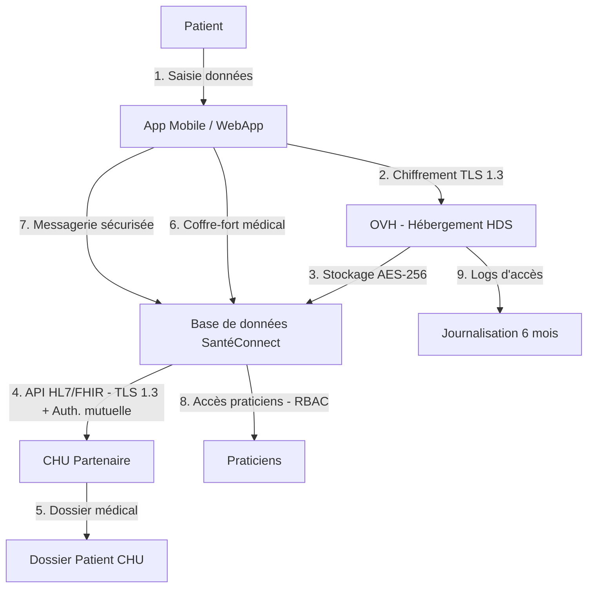

# Analyse d'Impact relative à la Protection des Données — SantéConnect

> **AIPD fictive** — Résumé synthétique pour projet portfolio GRC (SantéConnect, PME e-santé fictive). Le niveau de granularité illustre une cible de maturité RGPD, non l'état courant du marché TPE/PME santé.

AIPD obligatoire au vu des critères remplis par SantéConnect, réalisée avant mise en œuvre du traitement et mise à jour tout au long du cycle de vie du traitement.

---

## 1. Description du traitement

### 1.1 Vue d'ensemble

| | |
|---|---|
| **Description** | SantéConnect permet de collecter différents éléments du dossier médical patient en cardiologie pour permettre à tous les praticiens le suivant de disposer des données nécessaires les plus récentes et améliorer le suivi. |
| **Finalité** | Suivi cardiologique (incl. affichage dossier CHU, coffre-fort médical, messagerie praticien) pour patients ayant donné leur consentement éclairé, rétractable à tout moment. |
| **Enjeux** | Amélioration de la qualité de vie des patients cardiologiques grâce à un suivi plus rapide, réduction des hospitalisations d'urgence, et optimisation des coûts pour le système de santé (ex : évitement des réhospitalisations coûteuses). |
| **Responsable du traitement** | Martin Dupont (CEO, SantéConnect) — obligation de s'assurer de la conformité au RGPD (cf. fiches D-002 et D-005 du registre des traitements) |
| **Conseil et vérification** | DPO As A Service |
| **Sous-traitant** | OVH — hébergeur certifié HDS, hébergé en France (Gravelines) |
| **Autres acteurs** | Service Produit, RSSI, CHU partenaire |

**Critères rendant l'AIPD obligatoire :**

1. Traitements de données de santé pour la prise en charge des personnes — collecte de données sensibles (dossier patients) *(liste CNIL des opérations soumises à AIPD obligatoire)*
2. Collecte de données sensibles *(G29)*
3. Personnes vulnérables — patients souvent âgés *(G29)*

> **Note** : Le critère n°1 figure sur la liste CNIL des opérations soumises à AIPD obligatoire. Les critères 2 et 3 correspondent aux lignes directrices du G29 : 2 critères G29 suffisent à rendre l'AIPD obligatoire.

---

### 1.2 Description des données traitées

#### Données personnelles (non sensibles)

| Catégorie | Description | Durée de conservation | Base légale |
|---|---|---|---|
| État civil, identité, identification | Identité, photo de profil (optionnelle) | 5 ans après la dernière activité du patient | Consentement explicite granulaire + exécution du contrat — RGPD art. 6.1.a et 9.2.a |

#### Données sensibles (art. 9 RGPD)

| Catégorie | Description | Durée de conservation | Base légale |
|---|---|---|---|
| Données de santé | Dossier médical, analyses, ECG, comptes-rendus médicaux, ordonnances | Dossier médical : 20 ans. Archivage restreint après clôture du compte (accès réservé au CHU — CSP art. R. 1112-7). Archivage restreint pour autres praticiens (CSP art. R. 1111-10). | Consentement + exécution du contrat + nécessité pour les soins — RGPD art. 6.1.a, 6.1.b, 9.2.a, 9.2.h |
| Données de santé | Mesures personnelles, messages, agenda (ex : RDV ECG) | 5 ans après la dernière activité, ou suppression après clôture du compte si non liés à un dossier CHU. | RGPD art. 6.1.b + art. 9.2.a |
| Identifiant technique | NIR (liaison dossier CHU/FHIR) | 5 ans après la dernière activité, ou suppression après clôture du compte si non liés à un dossier CHU. | LIL art. 25 + RGPD art. 9.2.h |

> **Note — NIR** : Dans l'architecture SantéConnect, le NIR sert à lier le dossier patient de l'application avec le dossier CHU via HL7/FHIR. C'est un identifiant technique de liaison. Le NIR n'est pas une donnée de santé au sens de l'art. 9 RGPD, mais un identifiant à protection renforcée (LIL art. 25) traité dans le flux de soins — c'est précisément pourquoi il figure dans cette AIPD.

---

### 1.3 Flux de données

**Légende :**

| Flux | Description |
|---|---|
| 1–2 | Chiffrement en transit (TLS 1.3) |
| 3 | Chiffrement au repos (AES-256) |
| 4 | API sécurisée avec authentification mutuelle |
| 5 | Données CHU conservées 20 ans (CSP art. R. 1112-7) |
| 6–7 | Données générées par le patient (5 ans) |
| 8 | Accès limité par RBAC (rôles : patient, praticien, admin) |
| 9 | Logs conservés 6 mois, 1 an en cas d'incident |

---

### 1.4 Acteurs et responsabilités

| Acteur | Rôle | Précisions |
|---|---|---|
| SantéConnect | Responsable du traitement | Obligation de conformité RGPD |
| RSSI | Sécurisation système | Accès aux logs et métadonnées — exclusion des données de santé par conception |
| CHU Partenaire | Co-responsable (RGPD art. 26) | Lié par accord de co-responsabilité (RGPD art. 26) |
| OVH | Sous-traitant (RGPD art. 28) | Hébergement HDS — lié par clauses contractuelles de sous-traitance |
| Praticiens | Utilisateurs autorisés | Accès limité à leurs patients uniquement (RBAC) |

---

## 2. Évaluation de la proportionnalité et des droits

### 2.1 Proportionnalité et nécessité du traitement

**Justification de la proportionnalité :**

Les données collectées sont strictement nécessaires au suivi cardiologique :
- Dossiers médicaux (ECG, ordonnances) : indispensables pour le diagnostic et le traitement.
- Mesures personnelles (tension, poids) : indispensables pour le suivi en temps réel.
- Messages et agenda : indispensables pour la coordination entre patients et praticiens.
- Photo de profil : optionnelle (consentement séparé, RGPD art. 6.1.a).

**Minimisation :**

Les données sont minimisées par :
- Cloisonnement : base de données dédiée aux données de santé, séparée des données d'identification.
- Chiffrement : AES-256 au repos, TLS 1.3 en transit.
- Accès restreint : RBAC (rôles : patient, praticien, admin).

**Finalité :** Les données sont collectées pour fournir le service demandé par l'utilisateur — suivi cardiologique (cf. 1.1).

**Légitimité :** La finalité aux fins d'exécution du contrat (RGPD art. 6.1.b) est déterminée, explicite et légitime. La personne concernée a consenti au traitement de ses données pour la finalité susmentionnée.

> **Note — cas des aidants** : le consentement peut être fourni par une tierce personne ayant droit selon décision de justice (RGPD art. 9.2.g).

**Données exactes et tenues à jour :** SantéConnect s'engage à mettre les données à disposition dès qu'elles sont disponibles dans le système. L'exactitude et la fraîcheur des données dépendent en partie des praticiens concernés.

---

### 2.2 Mesures protectrices des droits des personnes concernées

- Présentation des conditions d'utilisation et de confidentialité dans les CGU et lors de la présentation du service par le CHU partenaire.
- Conditions rédigées de manière lisible et compréhensible.
- Consentement explicite (case à cocher) pour chaque type de données (ex : partage avec le CHU, coffre-fort médical).
- Présentation des données collectées lors de l'inscription au service.
- Présentation des droits de la personne concernée (retrait du consentement, suppression, etc.) dans les CGU.
- Information sur la sécurisation du stockage par OVH et par le CHU.
- Contact confidentialité : privacy@santeconnect.fr
- Information de la personne concernée de tout changement concernant les finalités, données collectées ou clauses de confidentialité dans l'application.
- **Droit à l'effacement (RGPD art. 17)** : via privacy@santeconnect.fr pour le service SantéConnect (sous 30 jours). Les données restant à la main des praticiens font l'objet d'un outil d'export dédié. Les données CHU sont soumises à l'archivage restreint 20 ans (CSP art. R. 1112-7).
- **Droit d'accès et portabilité (RGPD art. 15 et 20)** : dossier médical accessible via le CHU.
- **Mesures de recueil du consentement** : lors de l'inscription (acceptation CGU) + consentement granulaire par type de données et par praticien. Service destiné aux adultes. Un seul contrat.

---

## 3. Évaluation des risques

### 3.1 Grille d'évaluation 3×3

| Scénario | Actif | Vraisemblance | Gravité | Score | Mesures existantes |
|---|---|---|---|---|---|
| Accès illégitime | Dossiers patients OVH | 2 | 3 | **6** | Chiffrement AES-256, MFA |
| Accès illégitime | Flux HL7/FHIR CHU | 2 | 3 | **6** | TLS 1.3, authentification mutuelle |
| Modification non désirée | Données médicales | 1 | 3 | 3 | Logs d'intégrité, RBAC |
| Disparition des données | Backup OVH | 1 | 3 | 3 | PRA OVH HDS, RTO/RPO définis |
| Non-disponibilité interconnexion | Flux HL7/FHIR CHU | 2 | 1 | 2 | Risque accepté (mesures remédiation >> risque) |
| Déplacement latéral | API tierces | 1 | 1 | 1 | OAuth2 + validation entrées/sorties + cloisonnement par conception |

**Notes méthodologiques :**

- La **gravité** fait référence à l'impact sur les personnes concernées (patients), non sur SantéConnect. Ex : la non-disponibilité de l'interconnexion CHU est un impact business critique pour SantéConnect, mais la gravité pour les patients est moindre — le CHU peut toujours accéder au dossier, le suivi est ralenti mais pas arrêté.
- **Vraisemblance** : 1 = Faible (attaque sophistiquée) / 2 = Moyenne (erreur humaine, attaque opportuniste) / 3 = Élevée (vulnérabilité connue non corrigée).
- **Anonymisation pour statistiques/R&D** : agrégation k-anonymat, minimum 5 attributs. Si anonymisation non garantie, export CHU soumis à validation DPO.

---

### 3.2 Mesures et conclusion

**Niveau de risque résiduel**

Le niveau de risque résiduel est non négligeable, notamment en raison des incidents récents dans le secteur des PME et de la santé (ex : fuites de données chez des hébergeurs non certifiés HDS) et des vulnérabilités potentielles sur les API HL7/FHIR (zero-day, force brute).

| Scénario | Actif | Score | Mesures existantes | Risque résiduel |
|---|---|---|---|---|
| Accès illégitime | Dossiers patients OVH | **6** | Chiffrement AES-256, MFA | **Moyen** — vulnérabilité zero-day résiduelle |
| Accès illégitime | Flux HL7/FHIR CHU | **6** | TLS 1.3, authentification mutuelle | **Moyen** — compromission par force brute ou zero-day via API |
| Modification non désirée | Données médicales | 3 | Logs d'intégrité, RBAC | Faible — détection rapide via logs et RBAC |
| Disparition des données | Backup OVH | 3 | PRA OVH HDS, RTO/RPO définis | Faible — test sauvegarde + redondance CHU/praticiens |
| Non-disponibilité interconnexion | Flux HL7/FHIR CHU | 2 | Risque accepté | Faible — dossier médical existant au CHU et chez les praticiens |
| Déplacement latéral | API tierces | 1 | OAuth2 + validation + cloisonnement | Faible — segmentation et authentification robuste |

**Recommandations priorisées**

Les mesures suivantes sont recommandées pour ramener le risque résiduel à un niveau acceptable :

| Priorité | Mesure | Délai souhaité |
|---|---|---|
| 🔴 1 | Consultation CNIL (art. 36 RGPD) — risque résiduel moyen sur données de santé + validation légale des flux CHU | Sous 1 mois |
| 🔴 2 | Mise en place de procédures documentées de gestion des incidents | Sous 1 mois |
| 🟠 3 | Automatisation des audits de logs d'accès et de flux pour détection en temps réel | Sous 2 mois |
| 🟠 4 | Augmentation de la fréquence des audits d'accès RBAC à tous les trimestres | Sous 3 mois |
| 🟡 5 | Déploiement de l'outil web CNIL AIPD pour suivi de conformité | Sous 3 mois |
| 🟡 6 | Tableau de bord mensuel de conformité partagé en interne — sensibilisation des équipes | Sous 6 mois |

> **Note — consultation CNIL (art. 36)** : la consultation préalable est recommandée en raison du risque résiduel moyen persistant sur les deux scénarios à score 6 (accès illégitime données OVH et flux CHU) après application des mesures existantes, et de la nécessité de valider les flux de données avec le CHU dans le cadre de l'accord de co-responsabilité.

**Conclusion**

Le traitement peut être mis en œuvre sous deux conditions préalables : retour de la consultation CNIL (art. 36) et mise en place de la procédure documentée de gestion des incidents. Les quatre mesures complémentaires doivent être déployées dans les 6 mois suivant le lancement.

---

## 4. Validation de l'AIPD

| | Date de validation | Mise à jour |
|---|---|---|
| **DPO As A Service** | 10/01/2024 | 10/01/2025 |
| **CEO SantéConnect** (Martin Dupont) | 15/01/2024 | 15/01/2025 |
| **Revue technique RSSI** | 08/01/2024 | 08/01/2025 |

> Cet AIPD est mis à jour annuellement ou en cas de changement majeur (ex : nouveau partenaire, modification des flux de données, évolution réglementaire).

---

*Document produit dans le cadre du projet portfolio GRC — [github.com/solenefig-lab/grc-pme-fictive](https://github.com/solenefig-lab/grc-pme-fictive)*
*Ce document est une synthèse pédagogique. Il ne se substitue pas à une AIPD complète réalisée avec l'outil officiel CNIL PIA.*
