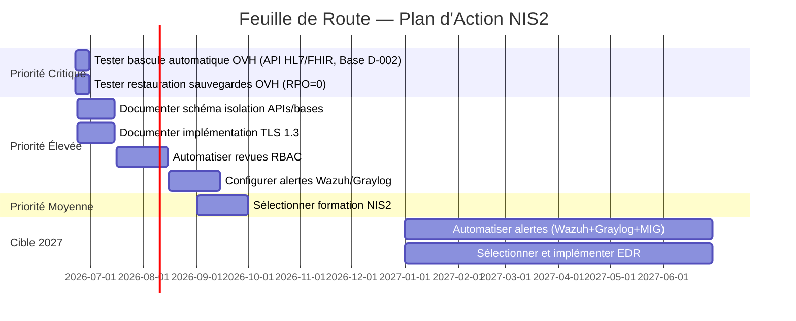

# Plan d'action sur les écarts avec exigences NIS2 et risques identifiés de SantéConnect

> Document fictif - Projet portfolio GRC - github.com/solenefig-lab/grc-pme-fictive Ce document est une synthèse pédagogique. Il ne se substitue pas à un audit réalisé par un organisme accrédité. Le niveau de granularité illustre une cible de maturité, non l'état courant du marché TPE/PME santé.

---

## **Sommaire**

1. [Contexte et Périmètre](#1-contexte-et-périmètre)
2. [Ecarts et Risques identifiés](#2-ecarts-et-risques-identifiés)
3. [Feuille de route](#3-feuille-de-route)
4. [Indicateurs de suivi](#4-indicateurs-de-suivi)
5. [Signatures](#5-signatures)

--- 

## 1. Contexte et Périmètre

### 1.1 Contexte

SantéConnect est impactée indirectement par NIS2 via les clauses contractuelles du CHU (entité essentielle).

**Exigences clés :**
- Art. 21 : Gestion des risques, PCA/PRA, sécurité de la chaîne d’approvisionnement, contrôle d’accès, surveillance continue.  
- Art. 23 : Notification des incidents (délais contractuels : 4h/24h/72h).  

**Périmètre :**
- Services critiques : API HL7/FHIR, Base D-002 (Traitement de Données Médicales), Interconnexion CHU.
- Outils existants : Wazuh, Graylog, Scripts Python (RBAC, bascule OVH).  

### 1.2. Objectifs

- Combler les écarts identifiés dans l'analyse d'impact NIS2.
- Aligner les contrôles ISO 27001:2022 existants sur les exigences identifiés NIS2.
- Arbitrer les mesures en tenant compte des exigences réglementaires et des contraintes de ressources.
- Opérationnaliser les mesures avec des actions concrètes, des échéances, et des responsables.

_Note : Documentation systématique (rapports, logs, scripts) pour garantir la traçabilité des décisions et mesures._

### 1.3. Documents de référence

| Document |  Version |  Date | Lien |
| ----------- | ------ | ------ | ------ | 
| Note de convention de co-responsabilité - CHU Fictif | V2.0 | 02/06/2026 | [note-coresponsabilite-CHU-maj-nis2.md](https://github.com/solenefig-lab/grc-pme-fictive/blob/main/semaine-4-nis2/note-coresponsabilite-CHU-maj-nis2.md) |
| Analyse d'impact NIS2 | V1.0 | 10/06/2026 | [analyse-impact-nis2.md](https://github.com/solenefig-lab/grc-pme-fictive/blob/main/semaine-4-nis2/analyse-impact-nis2.md)|
| PCA/PRA | V1.0| 19/06/2026| [pra-pca.md](https://github.com/solenefig-lab/grc-pme-fictive/blob/main/semaine-4-nis2/pra-pca.md)|
| ISO 27001:2022 — Contrôles | V1.2 | 21/02/2026 | [declaration-applicabilite.csv](https://github.com/solenefig-lab/grc-pme-fictive/blob/main/semaine-3-iso27001/declaration-applicabilite.csv)|
| Registre des traitements | V1.1|20/04/2024 |[registre-traitement.md](https://github.com/solenefig-lab/grc-pme-fictive/blob/main/semaine-2-rgpd-hds/registre-traitements/registre_traitement.md) |
|Fiche risques e-santé| V1.2 |10/12/2025 | [fiche-risques-e-sante.md](https://github.com/solenefig-lab/grc-pme-fictive/blob/main/semaine-1-gouvernance/fiche-risques-e-sante.md)|

---

## 2. Ecarts et Risques identifiés

> Ref.: [Analyse d'impact NIS2] et [PRA/PCA]

### 2.1. Synthèse des écarts NIS2

| Priorité | Gap NIS2 | Contrôle ISO 27001 | Risque Associé | ID Risque | Action Clé | Outil/Ressource | Responsable | Échéance | Statut |
| --- | --- | --- | --- | --- | --- | --- | --- | --- | --- | 
| 🔴 Critique | PCA/PRA non documenté | A.5.29-30, A.8.13 | Indisponibilité des services critiques | R-API-01, R-DON-01, R-GOV-02, R-NIS2-02 | Finaliser et tester le PCA/PRA (services critiques) | Scripts bascule_ovh.py, restore_db.py, OVH | RSSI | 30/06/2026 | 🔄 |
| 🟡 Modérée | Micro-segmentation non documentée | A.8.25-30 | Mouvement latéral via Man in the Middle | R-DON-02, R-DON-03, R-INT-01, R-DON-04  | Documenter la segmentation réseau (DMZ pour APIs) | Schéma réseau (draw.io), Firewall OVH | RSSI | 15/07/2026 | ✏️ |
| 🟡 Modérée | Revues RBAC non automatisées | A.5.9-18, A.8.2-3, A.8.5 | Usurpation d’identité | R-DON-01, R-PLAT-01 | Automatiser les revues RBAC (script Python) | Script script-revue-rbac.py, Wazuh | DevOps | 15/08/2026 | 📅  |
| 🟡 Modérée | Surveillance continue non formalisée | A.5.17, A.8.5, A.8.20 | Injection SQL / Ransomware | R-DON-03, R-APP-01, R-ISO-02 | Configurer des alertes dans Wazuh/Graylog | Règles Wazuh, Graylog | RSSI | 15/09/2026 | ✏️ |
| 🟡 Modérée | Preuves de formation NIS2 manquantes | A.6.3 | Absence de procédure de réponse | R-GOV-02, R-NIS2-02 | Former l’équipe à NIS2 (sensibilisation + bonnes pratiques) | Module e-learning NIS2, PV de formation | RH | 30/09/2026 | 📅  |

**Légende :**

 | Symbole | Signification | Action Recommandée |
 |---------|---------------|--------------------|
 | 🔴 | Risque Critique : bloquant pour la conformité contractuelle ou légale. | **Corriger sous 1 mois**. |
 | 🟡 | Risque Modéré: amélioration possible, non bloquant. | **Corriger sous 6 mois**. |
 | 🔄 | Finalisation demande encore certains tests | A tester | 
 | ✏️ | En cours de réalisation | A finaliser |
 | 📅 | Non commencé | A planifier, à implémenter |

### 2.2. Synthèse des Principaux Risques

| # | Risque | ID | Priorité | Gap NIS2 Associé | Contrôle ISO 27001 |
| --- | --- | --- | --- | --- | --- | 
| 1 | APIs mal configurées | R-API-01 | 🔴 Critique | PCA/PRA non documenté | A.5.29-30, A.8.13 | 
| 2 | Usurpation d’identité | R-DON-01 | 🔴 Critique | PCA/PRA non documenté, Revues RBAC non automatisées | A.5.9-18, A.8.2-3, A.8.5 | 
| 3 | Absence de TLS | R-DON-02 | 🟠 Élevée | Micro-segmentation non documentée | A.8.25-30 | 
| 4 | Injection SQL / Ransomware | R-DON-03 | 🟠 Élevée | Micro-segmentation non documentée, Surveillance continue non formalisée | A.5.17, A.8.5, A.8.20 | 
| 5 | Applications grand public | R-APP-01 | 🟠 Élevée | Surveillance continue non formalisée | A.5.17, A.8.5, A.8.20 | 
| 6 | Plateforme B2B — accès non restreint | R-PLAT-01 | 🟡 Moyenne | Revues RBAC non automatisées | A.5.9-18, A.8.2-3, A.8.5 | 
| 7 | Interconnexion CHU | R-INT-01 | 🟠 Élevée | Micro-segmentation non documentée | A.8.25-30 | 
| 8 | Délai de notification des violations | R-GOV-02 | 🟡 Moyenne | Preuves de formation NIS2 manquantes, PCA/PRA non documenté | A.6.3 | 
| 9 | Vulnérabilités non patchées | R-ISO-02 | 🟡 Moyenne | Surveillance continue non formalisée | A.5.17, A.8.5, A.8.20 | 
| 10 | Absence de procédure de réponse aux incidents | R-NIS2-02 | 🟡 Moyenne | Preuves de formation NIS2 manquantes, PCA/PRA non documenté| A.6.3 |
| 11 | Données PII exposées via App Mobile | R-DON-04 | 🟠 Élevée | Micro-segmentation non documentée | A.8.25-30 |

**Légende des Priorités :**

| Priorité | Action Recommandée |
| --- | --- | 
| 🔴 Critique | Traiter immédiatement (sous 1 mois). |
| 🟠 Élevée | Traiter sous 3-6 mois. |
| 🟡 Moyenne | Traiter sous 6 mois. |

_Notes :_
_- la correspondance entre les Ecarts et les Risques est complète._ 
_- la priorité risque peut être plus haute que la priorité d'écart identifiée car les premiers sont évalués par rapport à l'impact et la probabilité du-dit risque et le deuxième par rapport au exigences liés à NIS2._

### 2.3. Synthèse des Actions non finalisées dans le PRA/PCA

| Étape | Action | Responsable | Statut d'implémentation |
| --- | --- | --- | --- | 
| Activation PCA | Bascule automatique sur le serveur de secours OVH (script Python) pour les services critiques (API HL7/FHIR, Base D-002). | RSSI |  🔄 À tester |
| Restauration (PRA) | Si nécessaire, restauration depuis les sauvegardes OVH (RPO = 0 pour la Base D-002). | RSSI |  🔄 À tester |
| Détection |  Automatiser les alertes et améliorer les intégrations entre les différents outils(Wazuh + Graylog + MIG)| RSSI | 🎯 cible 2027 |
| Détection |  Sélectionner et implémenter un EDR (Endpoint Detection and Response) | RSSI | 🎯 cible 2027 |

_Note : RPO = 0 : objectif zéro perte de données via réplication synchrone - cible de maturité._

---

## 3. Feuille de route

| Ecart | Action | Responsable | Echéance | Documentation |
| --- | --- | --- | --- |  --- | 
| PRA/PCA | Tester bascule automatique sur le serveur de secours OVH (script Python) pour les services critiques (API HL7/FHIR, Base D-002). | RSSI | 30/06/2026 | Scripts Python, Rapport de test, PRA/PCA mis à jour |
| PRA/PCA | Tester restauration depuis les sauvegardes OVH (RPO = 0 pour la Base D-002). | RSSI | 30/06/2026 | Rapport de test, PRA/PCA mis à jour |
| PRA/PCA |  Automatiser les alertes et améliorer les intégrations entre les différents outils (Wazuh + Graylog + MIG)| DevOps | 2027 | Règles de configuration , Rapport de test, PRA/PCA mis à jour |
| PRA/PCA | Sélectionner et implémenter un EDR (Endpoint Detection and Response) | RSSI | 2027 | Appel d'offre, Contrat, PRA/PCA |
| Micro-segmentation | Documenter schéma isolation des APIs et bases | RSSI | 15/07/2026 | Schéma réseau, Caractéristiques Firewall OVH |
| Micro-segmentation | Documenter implémentation et vérification TLS 1.3. | DevOps | 15/07/2026 | Schéma réseau |
| Revues RBAC | Automatisation des revues d’accès | DevOps | 15/08/2026 | Script d'automatisation, Logs |
| Surveillance continue | Configurer des alertes dans Wazuh/Graylog |  RSSI | 15/09/2026 | Règles Wazuh, Graylog |
| Formation NIS2 | Sélection formation NIS2 et déploiement progressif | RH | 30/09/2026 (sélection) | Appel d'offre, Contrat, PV de formation |

_Notes : 
_- la procédure de réponse aux incidents est documenté dans le PRA/PCA._
_- prévoir la mise à jour du PSSI à réalisation des principales actions impactant les procédures de sécurité._

---

## 4. Indicateurs de suivi

| KPI | Objectif | Mesure | Responsable | Fréquence |
| --- | --- | --- | --- | --- |
| % des gaps NIS2 comblés | 100% | Nombre de gaps résolus / Total | RSSI | Mensuel |
| Temps moyen de détection | < 15 min | Délai entre incident et alerte (Wazuh) | DevOps | Trimestriel |
| Temps moyen de réponse | < 4h (P1) | Délai entre détection et activation PCA | RSSI | Trimestriel |
| % des revues RBAC automatisées | 100% | Nombre de revues automatisées / Total | DevOps | Mensuel |
| % de l’équipe formée à NIS2 | 100% | Nombre de personnes formées / Total | RH | Trimestriel |

---

## 5. Signatures

Version 1.0 : 19/06/2026 |  Révision annuelle complète : 19/06/2027

Signataires :

| Rôle | Nom | V1.0 |
| --- | --- | --- | 
| CEO SantéConnect | Martin DUPONT | 19/06/2026 |
| DPO SantéConnect (As a Service) | Jeanne PETIT | 19/06/2026 |
| RSSI | Claire ESPINOZA | 19/06/2026 |
| RH |  Bernard THOMAS | 19/06/2026 |

---

*Document produit dans le cadre du projet portfolio GRC - [github.com/solenefig-lab/grc-pme-fictive](https://github.com/solenefig-lab/grc-pme-fictive)*
*Ce document est une synthèse pédagogique. Il ne se substitue pas à un audit réalisé par un organisme accrédité.*

