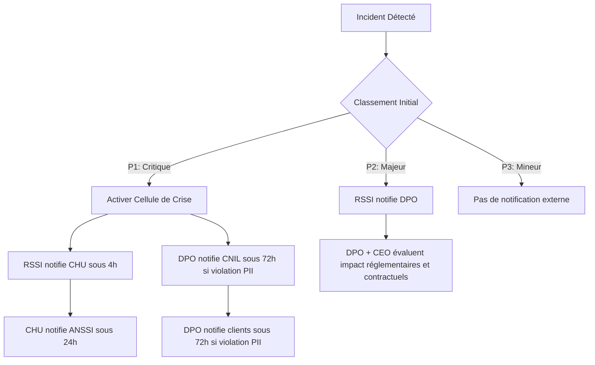

# Plan de Rétablissement et de Continuité de l'Activité de SantéConnect (PRA/PCA)

> Document fictif - Projet portfolio GRC - github.com/solenefig-lab/grc-pme-fictive Ce document est une synthèse pédagogique. Il ne se substitue pas à un audit réalisé par un organisme accrédité. Le niveau de granularité illustre une cible de maturité, non l'état courant du marché TPE/PME santé.

---

## **Sommaire**

1. [Contexte et Périmètre](#1-contexte-et-périmètre)
2. [Analyse des Risques et des Impacts](#2-analyse-des-risques-et-des-impacts)
3. [Stratégie de Continuité et de Reprise](#3-stratégie-de-continuité-et-de-reprise)
4. [Procédures Opérationnelles](#4-procédures-opérationnelles)
5. [Revue et Amélioration](#5-tests-maintenance-et-amélioration)
6. [Annexes](#6-annexes)
7 [Signatures](#7-signatures)

--- 

## 1. Contexte et Périmètre

### 1.1. Objectifs du PRA/PCA

- Assurer la continuité des services critiques (ex : accès aux dossiers patients, plateforme de télémédecine).  
- Minimiser l’impact des incidents (cyberattaques, pannes, erreurs humaines).  
- Respecter les obligations réglementaires, en particulier :
    - NIS2 et ReCyf (Référentiel Cyber France - document de travail): obligation de résilience opérationnelle, impacté via les clauses contractuelles avec établissement de santé, CHU Fictif, réf.: [Note coresponsabilité CHU Fictif](https://github.com/solenefig-lab/grc-pme-fictive/blob/main/semaine-4-nis2/note-coresponsabilite-CHU-maj-nis2.md)
    - Démarche ISO 27001:2022 engagée par SantéConnect, notamment Art. A.5.29 Sécurité de l'information en cas de perturbation, A.5.30. Préparation des TIC à la continuité des activités, A.8.13. Sauvegarde des informations
    - RGPD: protection des données privées et sensibles
    - HDS: Hébergement des Données de Santé
    - PCI-DSS: obligations pour paiements par cartes bancaires, encadrée dans les clauses de sous-traitance avec Stripe, réf.: [Synthèse clauses sous-traitants](https://github.com/solenefig-lab/grc-pme-fictive/blob/main/semaine-2-rgpd-hds/synthese-clauses-sous-traitants.md)
- Aligner toutes les procédures et politiques de gestion d'incidents et de sécurité de l'information.

### 1.2. Axes clés 

- Gouvernance (rôles, responsabilités, politique de sécurité).
- Protection (mesures techniques et organisationnelles).
- Détection (surveillance, logs, SIEM).
- Réponse (plans d’urgence, communication de crise).
- Rétablissement (reprise après incident).

### 1.3. Périmètre

| Asset | Détails |
| --- | --- |
| Processus critiques | Plateforme de télémédecine, gestion des dossiers patients, facturation, support client. |
| Systèmes | Serveurs (cloud/on-premise), bases de données, applications métiers, postes de travail. |
| Données | Dossiers patients (sensibles), données de facturation, logs. |
| Ressources humaines | 2-3 techniques (admin système, réseau). |
| Parties prenantes | Hébergeur, partenaire CHU, éditeurs logiciels, patients, practiciens B2C, autorités (ANSSI, CNIL). |

### 1.4. Rôles et Responsabilités

| Rôle | Responsabilité |
|---|---|
| Direction (CEO) | Valide les décisions stratégiques et le budget sécurité |
| RSSI (salarié, temps partiel) | Pilote la sécurité technique et la conformité |
| DPO (service externe) | Garant de la conformité RGPD/HDS |
| Responsable Produit | Garant Privacy by Design et Security by Design |
| DevOps | Implémente les mesures techniques (chiffrement, sauvegardes, logs) |
| Responsables Métiers (RH, Comptabilité) | Garants de la protection des données de leur périmètre |
| Utilisateurs | Respect des règles de sécurité |

_Note : le RSSI est responsable du PRA / PCA, le CEO est en copie en cas d'incident pouvant être majeur ou élevé et pourra désigner un pilote temporaire en l'absence du RSSI (temps partiel)_

---

## 2. Analyse des Risques et des Impacts

### 2.1. Identification des Processus Critiques

| Processus | Niveau | Justification |
| --- | --- | --- | 
| Accès aux dossiers patients | 1 | Fuite de données privées sensibles. |
| Authentification patients | 1 | Fuite de données et mouvement latéral possible. |
| Plateforme B2C | 1 | Continuité des soins et coeur du service (réputation). |
| Accès données RH employés | 1 | Fuite de données et mouvement latéral possible. |
| Facturation | 2 | Impact financier. |
| Authentification praticiens | 2 | Fuite de données du praticien. |
| Site web vitrine | 3 | Image de marque. |

**Classement par niveau de criticité :**

| Score | Niveau | Définition |
|-------|--------|------------|
| 1 | Critique | Conséquence importante, effet négatif sur le bon fonctionnement ou contrainte réglementaire |
| 2 | Modéré | Perturbation partielle, impact métier limité |
| 3 | Faible | Conséquence limitée, sans effet sur le fonctionnement |
 

### 2.2. Scénarios de Risque

**Top-5 des risques prioritaires :**

> Classement par **impact** (réglementaire + business + réputationnel).  
> Les risques 2 à 5 sont des **angles morts** fréquemment oubliés dans la sécurisation d'un réseau, pourtant vecteurs d'attaques de plus en plus courants.  
> Réf.: [Fiche risques e-santé](https://github.com/solenefig-lab/grc-pme-fictive/blob/main/semaine-1-gouvernance/fiche-risques-e-sante.md)  

| Priorité | Risque | Asset | Score | Recommandation |
|----------|--------|-------|-------|----------------|
| 1 | Fuite de données via élévation de privilèges | Données personnelles + santé + paiement | 6 | Mettre en place l'authentification 2FA sur tous les accès critiques et appliquer le principe du moindre privilège (least privilege) sur tous les comptes. |
| 2 | Mouvement latéral via Man in the Middle | Équipement routage | 6 | Mettre en place une politique d'autorisation stricte pour tout ajout d'équipement (refus par défaut) et interdire les périphériques USB non autorisés. |
| 3 | Intrusion via port ouvert | Équipement routage | 6 | Désactiver Telnet sur tous les équipements réseau et remplacer par SSH avec authentification par clé. Cartographier tous les ports ouverts et fermer ceux non nécessaires. |
| 4 | Fuite de données via mauvaise configuration API | APIs | 6 | Mettre en place une authentification robuste (OAuth2) et une validation stricte des entrées/sorties sur toutes les APIs exposées. |
| 5 | Intrusion via vol de clé de configuration API | APIs | 6 | Scanner les secrets existants (tokens, credentials) dans les dépôts de code et mettre en place un `.gitignore` + rotation régulière des clés. |

### 2.3. Matrice de Criticité

**Priorité** : Traiter en premier les risques avec **Probabilité Élevée + Impact Élevé**.  
**Référence** : [Plan de Traitement des Risques - ISO 27001:2022](https://github.com/solenefig-lab/grc-pme-fictive/blob/main/semaine-3-iso27001/plan-traitement-risques.md)

**Axe X** : Probabilité (Faible → Moyenne → Élevée).  
**Axe Y** : Impact (Faible → Moyen → Élevé).

| Impact \ Probabilité | 1 (Faible) | 2 (Moyen) | 3 (Élevé) |
| --- | --- | --- | --- |
| 3 (Élevé) | 🟠 Élevée | 🟠 Élevée | 🔴 Critique |
|  |  | | R-API-01 |
|  |  |  | R-DON-01 |
|  |  |  | R-DON-02 |
|  |  |  | R-DON-04 |
| 2 (Moyen) | ⚪ Faible | 🟡 Moyenne | 🟠 Élevée |
|  |  | R-GOV-02 | R-DON-03 |
|  |  | R-NIS2-02 | R-APP-01 |
|  |  | R-PLAT-01 | R-INT-01 |
| 1 (Faible) | ⚪ Faible | ⚪ Faible | 🟡 Moyenne |
|  |  |  | R-ISO-02 |

**Note :**
- Les scores sont calculés comme suit : Probabilité × Impact (1 à 3 pour chaque axe).  
- Les priorités sont attribuées selon le score total (ex: 9 = Critique, 6 = Élevée).  
- Les actions et budgets sont alignés sur les ressources de SantéConnect.  

**Tableau des Risques et Scores**
Score = [Probabilité, Impact]

| # | Risque | ID | Score | Priorité | 
|:-:|--------|:--:|:-----:|:--------:|
| 1 | APIs mal configurées | R-API-01 |  [3, 3] | 🔴 Critique |
| 2 | Usurpation d'identité | R-DON-01 |[3, 3] |  🔴 Critique | 
| 3 | Absence de TLS | R-DON-02 | [3, 2] | 🟠 Élevée | 
| 4 | Injection SQL / Ransomware | R-DON-03 |[2, 3]| 🟠 Élevée | 
| 5 | Applications grand public | R-APP-01 |  [3, 2] | 🟠 Élevée | 
| 6 | Plateforme B2B — accès non restreint | R-PLAT-01 | [2, 2] | 🟡 Moyenne |
| 7 | Interconnexion CHU | R-INT-01 | [3, 2] | 🟠 Élevée | 
| 8 | Délai de notification des violations | R-GOV-02 | [2, 2] | 🟡 Moyenne | 
| 9 | Vulnérabilités non patchées | R-ISO-02 |  [3, 1] | 🟡 Moyenne | 
| 10 | Absence de procédure de réponse aux incidents | R-NIS2-02 | [2, 2] | 🟡 Moyenne | 
| 11 | Données PII exposées via app mobile | R-DON-04 |   [3, 2] | 🟠 Élevée |

**Légende des Zones**

| Zone | Condition | Priorité | Action Recommandée |
| --- | --- | --- | --- |
| 🔴 Critique | Probabilité = 3 et Impact = 3 | Critique | Traiter immédiatement |
| 🟠 Élevée | Score total = 6 (ex: 2×3, 3×2) | Élevée | Traiter sous 1-3 mois |
| 🟡 Moyenne | Score total = 3 ou 4 (ex: 1×3, 2×2) | Moyenne | Traiter sous 6 mois |
| ⚪ Faible | Score total ≤ 2 (ex: 1×1, 1×2) | Faible | Surveillance annuelle |

---

## 3. Stratégie de Continuité et de Reprise

### 3.1. Fixation RTO (Durée Maximum de Restauration) et RPO (Objectifs Point de Restauration)

SantéConnect a fixé les objectifs suivants pour les processus et données critiques: RTO 72h, RPO 24h, Délai d'activation 4h. 
Pour les services non critiques (ex : App Mobile), le délai d’activation du PCA/PRA est 24h (aligné sur HDS R. 1112-7).

| Processus | Niveau | Justification |
| --- | --- | --- |
| Accès aux dossiers patients | 1 | Obligation légale (RGPD, ReCyF). |
| Plateforme de télémédecine | 1 | Continuité des soins. |
| Facturation | 2 | Impact financier. |
| Site web vitrine | 3  | Image de marque. |

> **Conformité RGPD/HDS :** Même pour les données non critiques, SantéConnect doit garantir la disponibilité et l'intégrité des données qu'elle gère (historiques partagés, plannings) et pouvoir restaurer ses services sous 72h pour éviter une violation de la sécurité des données.

L’exigence contractuelle du CHU impose une activation du PCA/PRA sous 4h pour les incidents critiques (ex : indisponibilité de l’API HL7/FHIR ou de la Base D-002).
La faisabilité de ce délai repose sur :
- Automatiser les étapes clés (scripts de bascule, alertes).
- Déléguer les rôles en cas d’incident.
- Pré-tester les procédures (PCA/PRA validés en amont).

| Étape | Action | Outil/Responsable | Délai | Statut d'implémentation |
| --- | --- | --- | --- | --- | 
| 1. Détection | Alerte automatique via Wazuh (ex : panne serveur, attaque détectée) ou signalement manuel (email : incident@santeconnect-demo.fr). | Wazuh + Graylog | < 15 min | ✅ |
| 2. Qualification | Le RSSI (Claire ESPINOZA) ou le DevOps de garde (Stéphane ROY) qualifie l’incident comme critique (P1) via la matrice de criticité (cf. Section 2.3). | Matrice de criticité + Slack (#incidents) | < 30 min | ✅ |
| 3. Activation PCA | Bascule automatique sur le serveur de secours OVH (script Python) pour les services critiques (API HL7/FHIR, Base D-002). | Script bascule_ovh.py + OVH | < 1h |  🔄 À tester |
| 4. Notification | Notification immédiate au CHU (email : it@chu-fictif.fr) et au DPO (Jeanne PETIT). | Email + Slack | < 1h |  ✅ |
| 5. Restauration (PRA) | Si nécessaire, restauration depuis les sauvegardes OVH (RPO = 0 pour la Base D-002). | Sauvegardes OVH + Script restore_db.py | < 4h |  🔄 À tester |
| 6. Validation | Tests de fonctionnement par le DevOps et validation avec le CHU. | Tests manuels + CHU | < 30 min | ✅ |
| 7. Clôture | Documentation de l’incident dans le Registre des incidents et REX sous 72h. | Registre des incidents | < 72h | ✅ |

### 3.2. PCA - Mécanismes de continuité d'activité

SantéConnect fixe les objectifs suivants : 
- **Maintien des services critiques en fonctionnement** 
- **Tests annuels :** SantéConnect testera son PCA/PRA au moins une fois par an et fournira les preuves au CHU.
- **Activation sous 4h :** En cas d’incident critique, le déclenchement de la procédure PCA/PRA sera activé sous 4h.

En cas d'interruption majeure, la continuité des soins est assurée par le CHU qui dispose des données patients par ailleurs. SantéConnect maintient un accès en lecture seule aux données non médicales via interface web OVH sur environnement isolé.
- Déclenchement sur validation RSSI et CEO.
- Seuil de déclenchement : incident P1 confirmé, ou indisponibilité > 30 minutes.

Le CHU et les praticiens disposent des données patients par ailleurs, ce qui sécurise la continuité des soins pendant la restauration.

| Solution | Description | Avantages |
| --- | --- | --- |
| Sauvegardes 3-2-1 | 3 copies, 2 supports (NAS + cloud), 1 hors site. |  Intégrité des données garantie. |
| Télétravail | Postes portables de secours + VPN sécurisé. |  Flexibilité, pas de site physique nécessaire. |
| Générateur électrique | Pour les locaux techniques. | Autonomie 24h. |

_Note : dans un PRA PCA en contexte réelle, une colonne supplémentaire budget serait ajoutée avec une estimation pour chaque solution pour aider au pilotage et à l'arbitrage._

### 3.3. PRA - Restauration après interruption majeure
*Validé par RSSI et CEO, supervision DPO*

- Restaurer la dernière sauvegarde quotidienne pour les données critiques, mensuelle pour les autres
- Vérifier l'intégrité des données avant mise en production
- Conserver les logs de tests de restauration (preuve)

| Scénario | Solution | Étapes clés |
| --- | --- | --- |
| Cyberattaque | Restauration depuis sauvegardes clean + isolation des systèmes infectés. | 1. Isoler le réseau. 2. Restaurer les données. 3. Analyser la cause (logs, EDR). |
| Panne serveur | Bascule vers le serveur de secours + réparation. | 1. Basculer en 30 min. 2. Contacter l’hébergeur. 3. Tester les applications. |
| Fuite de données | Containment + notification CNIL/ANSSI sous 72h. | 1. Identifier la source. 2. Limiter l’accès. 3. Notifier les autorités. |

### 3.4. Coordination avec les Parties Prenantes

| Catégorie | Partie prenante | Description |
| --------- | --------- | --------- |
| Partenaire | CHU | SLA et coordination en lien avec clauses co-responsabilité (supply chain). |
| Fournisseurs | Hébergeur | SLA avec engagement de RTO/RPO (selon SLA OVH contractualisé). |
| Fournisseurs | Éditeurs logiciels | Support 24/7 pour les applications critiques. |
| Autorités | ANSSI | CHU: Reporting sous 24h pour les incidents majeurs (NIS2) |
| Autorités | CNIL | Notification sous 72h en cas de fuite de données (RGPD). |
| Clients | Patients | Communication transparente (ex : "Service temporairement indisponible, vos données sont sécurisées").|
| Clients | Practiciens B2C | Communication transparente (ex : "Service temporairement indisponible, vos données sont sécurisées").|

### 3.5. Preuves de conformité

| Exigence Contractuelle | Preuve | Fréquence | Responsable |
| --- | --- | --- | --- |
| Activation PCA/PRA sous 4h | Rapport de test PCA/PRA | Trimestrielle | DevOps + RSSI |
| Bascule automatique | Logs OVH+ Script bascule_ovh.py | À chaque incident | DevOps |
| Restauration depuis sauvegardes | Rapport de restauration | Trimestrielle | DevOps |
| Notification sous 4h | Email envoyé + Fiche d’incident | À chaque incident | RSSI + DPO |

----

## 4. Procédures Opérationnelles

### 4.1. Détection et Alerte

**Outils :**
- Détection : Wazuh (open source, détection des intrusions, analyse des logs, alertes) 
- Centralisation des logs : Graylog.
- Sauvegardes : Synology NAS + Backblaze.
- Outil d'investigation forensique: MIG by Mozilla.

Cible de maturité : 
- automatiser les alertes et améliorer les intégrations entre les différents outils.  
- sélectionner et implémenter un EDR (Endpoint Detection and Response).

**Processus :**
- Alerte automatique : Email/SMS au pilote PCA et à l’équipe technique + copie CEO (alerte supposée niveau élevée ou critique)
- Escalade : Si non résolu en 30 min → activation de la cellule de crise.

### 4.2. Réponse Immédiate
Checklist par scénario :

**Cyberattaque (ransomware) :**
- Isoler les systèmes infectés (désactiver les accès réseau).
- Identifier la source (analyse des logs, EDR).
- Contacter l’hébergeur et le support logiciel.
- Ne pas payer la rançon (conformément aux recommandations ANSSI).

**Panne serveur :**
- Vérifier les onduleurs/générateurs.
- Basculer vers le serveur de secours.
- Contacter le fournisseur pour réparation.

**Fuite de données :**
- Identifier les données concernées.
- Limiter l’accès (revocation des droits, isolation).
- Notifier la CNIL et les personnes concernées sous 72h.

_Note: le RSSI ajoutera de nouveaux scénarii ou amendera les existants selon l'état de veille des risques et menaces._

### 4.3. Restauration

Étapes :
- Valider l’intégrité des sauvegardes (checksum, tests de restauration).
- Restaurer les données sur un environnement clean (ex : nouvelle VM).
- Tester les applications critiques avant remise en production.

Validation :
- Équipe métier : Vérification des données patients (ex : échantillon de dossiers).
- Équipe technique : Tests de performance et de sécurité.

### 4.4. Communication

Interne :
- Cellule de crise : Réunions toutes les 2h en mode dégradé.
- Équipes : Messages clairs via Slack/Teams (ex : "Passez en télétravail, utilisez le VPN X").

Externe :
- Patients : Message type (ex : "Notre service est temporairement indisponible pour des raisons de sécurité. Vos données sont protégées.").
- Autorités : 
    - SantéConnect notifie la CNIL sous 72h (RGPD art. 33) 
    -le CHU notifie simultanément l’ANSSI (Agence Nationale de la Sécurité des Systèmes d'Information) en tant qu'entité essentielle soumise à NIS2 si applicable.

Partage des coûts liés à la gestion de l'incident (notification aux patients, audits) au prorata de la responsabilité de chaque partie

**Exemple arbre décisionnel**

--- 

## 5. Tests, Maintenance et Amélioration

### 5.1. Tests Réguliers

| Type de test | Fréquence | Responsable | Objectif |
| --- | --- | --- | --- |
| Test de sauvegarde | Mensuel | Équipe technique | Vérifier l’intégrité et la restaurabilité. |
| Simulation de panne | Trimestriel | Équipe technique | Tester les procédures de bascule. |
| Exercice de crise | Annuel | Cellule de crise | Valider la coordination et la communication. |
| Audit ReCyF | Annuel | RSSI | Vérifier la conformité au référentiel. |

### 5.2. Revue et Amélioration

**Retour d’expérience (REX) :**
Après chaque test ou incident réel, documenter :
- Points forts (ex : restauration réussie en 1h).
- Points faibles (ex : délai trop long pour contacter l’hébergeur).
- Actions correctives (ex : négocier un SLA plus strict) avec priorisation, responsable, budget et délai.

**Mises à jour :**
- Pilote : RSSI
- Annuel : Réviser le PRA/PCA (ex : nouveau logiciel, changement d’hébergeur).
- Ad hoc : Après un incident ou un changement majeur (ex : fusion, nouvelle réglementation).

### 5.3. Documentation

Stockage PRA/PCA :
- Version numérique : 
    - Complet : Cloud sécurisé (ex : SharePoint avec accès restreint + chiffrement).
    - Procédure de notification et d'escalade en cas d'incidents : espace dédié en ligne sur page Intranet.
- Version physique : 
    - Complet : Coffre-fort ou lieu sûr (pour accès hors ligne).
    - Procédure de notification et d'escalade en cas d'incidents : dossier conservé par l'Assistant(e) de Direction.

Accessibilité :
- Équipe technique : Accès complet.
- Équipe métier : Accès aux procédures les concernant (ex : "Que faire en cas de panne ?").

---

### 6. Annexes
## 6.1. Liste des Contacts

| Rôle | Nom/Service | Organisation | Contact | Disponibilité | SLA/Contrat | Escalade | Notes |
| --- | --- | --- | --- | --- | --- | --- | --- |
| Responsable PCA/PRA | RSSI | Claire ESPINOZA | SantéConnect | E-mail + téléphone pro. | Lundi au jeudi | CEO | Contact principal pour la coordination des incidents critiques. |
| Responsable Technique | Stéphane ROY | SantéConnect | E-mail + téléphone pro. | Jours ouvrés | RSSI | Exécution des scripts de bascule et restauration. |
| DPO | Jeanne PETIT | SantéConnect (As a Service) | E-mail + téléphone pro. | +33 1 XX XX XX XX | Jours ouvrés (9h-18h) | RSSI | Notification RGPD et validation des procédures. |
| Responsable Sécurité CHU | Département IT | CHU Partenaire | [it@chu-fictif.fr](mailto:it@chu-fictif.fr)  +33 2 XX XX XX XX | 24/7 | RSSI SantéConnect | Validation des bascules et restaurations. |
| Support Technique OVH (SLA Gold) | Équipe SLA OVH | OVHcloud | [support-sla@ovh.com](mailto:support-sla@ovh.com)  +33 9 72 10 10 07 | 24/7/365 | Responsable Technique SantéConnect | Temps de réponse garanti : < 15 min (SLA Gold). Référence contrat : SC-2026-OVH-12345. |
| Support Urgent OVH (Incidents Critiques) | Hotline OVH | OVHcloud | [emergency@ovh.com](mailto:emergency@ovh.com)  +33 9 72 10 10 00 | 24/7/365 | Responsable Technique SantéConnect | Priorité absolue pour les incidents impactant les services critiques (API HL7/FHIR, Base D-002). |

## 6.2. Inventaire des Actifs
Réf.: [Fiches Risques e-santé](https://github.com/solenefig-lab/grc-pme-fictive/blob/main/semaine-1-gouvernance/fiche-risques-e-sante.md)

## 6.3. Modèles de Notification

Notification CNIL - pilote DPO : réf. [Procédures Incident et Notification](https://github.com/solenefig-lab/grc-pme-fictive/blob/main/semaine-2-rgpd-hds/procedure-incident-notification.md)

---

## 7. Signatures

Version 1.0 : 19/06/2026 |  Révision annuelle complète : 19/06/2027

Signataires :

| Rôle | Nom | V1.0 |
| --- | --- | --- | 
| CEO SantéConnect | Martin DUPONT | 19/06/2026 |
| DPO SantéConnect (As a Service) | Jeanne PETIT | 19/06/2026 |
| RSSI | Claire ESPINOZA | 19/06/2026 |

---

*Document produit dans le cadre du projet portfolio GRC - [github.com/solenefig-lab/grc-pme-fictive](https://github.com/solenefig-lab/grc-pme-fictive)*
*Ce document est une synthèse pédagogique. Il ne se substitue pas à un audit réalisé par un organisme accrédité.*