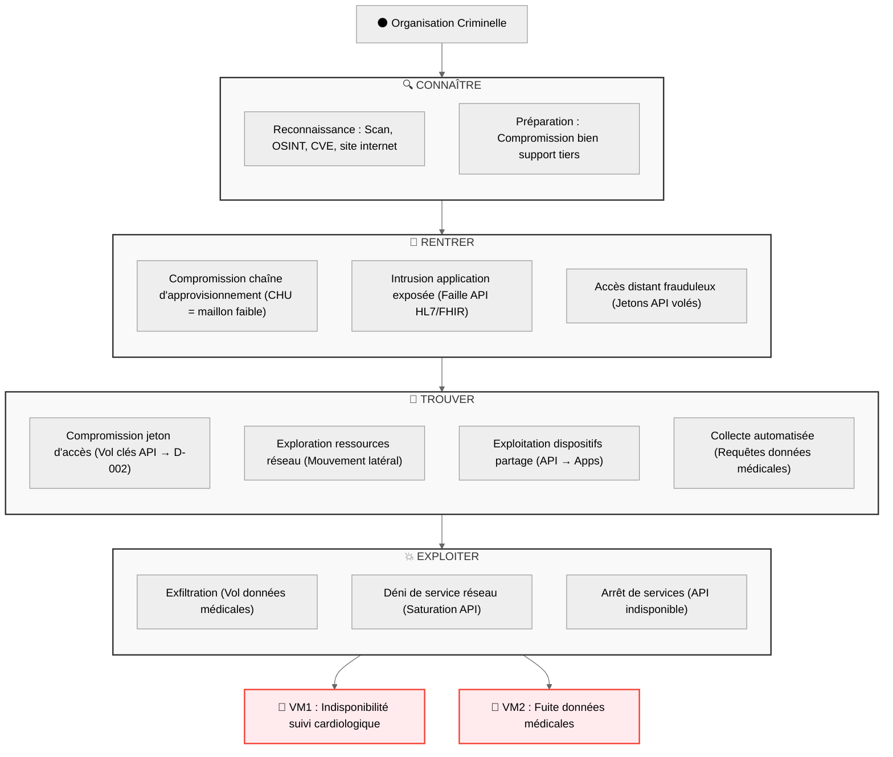

# Atelier 4 : Scénarios opérationnels et leur vraisemblance

> Document fictif - [Projet portfolio GRC](github.com/solenefig-lab/grc-pme-fictive) Ce document est une synthèse pédagogique. Il ne se substitue pas à un audit réalisé par un organisme accrédité. Le niveau de granularité illustre une cible de maturité, non l'état courant du marché TPE/PME santé.

---

## **Sommaire**

1. [Cadre et objectifs](#1-cadre-et-objectifs)
2. [Rappel des livrables des autres ateliers](#2-rappel-des-livrables-des-autres-ateliers)
3. [Élaborer les scénarios opérationnels](#3-élaborer-les-scénarios-opérationnels)
4. [Évaluer la vraisemblance des scénarios opérationnels](#4-évaluer-la-vraisemblance-des-scénarios-opérationnels)
5. [Signatures](#5-signatures)

___

## 1. Cadre et Objectifs

### 1.1. Objectif

**Objectif principal du projet :** Anticipation cadre ReCyF (application française de NIS2) dans le cadre du partenariat avec CHU Fictif (obligations spécifiques à SantéConnect comme sous-traitant de services essentiels).

**Objectif de l'atelier 4 - Scénarios opérationnels**
- Identifier les Biens Supports critiques pouvant servir de vecteurs d'entrée ou d'exploitation.  
- Schématiser les scénarios opérationnels, à savoir les modes opératoires possibles des Sources de Risque (SR) pour la mise en oeuvre des scénarios stratégiques en se concentrant sur les Biens Supports.  
- Evaluer vraisemblance des scénarios opérationnels.  

_Notes :_  
_- A chaque chemin d'attaque stratégique retenu dans l'Atelier 3 correspond un chemin opérationnel permettant à la SR d'atteindre son Objectif Visé (OV)._  
_- L'Atelier 4 s'inscrit dans le cycle opérationnel de l'entreprise et les modélisations des scénarios opérationnels peuvent faire l'objet d'itération (2 max. recommandé)._

### 1.2. Participants

| Rôle | Nom | Responsabilité | 
| ----- | ----- | --------- | 
| RSSI | Claire ESPINOZA | R |
| DevProduit - Responsable architecture technique et intégration API | Stéphane ROY | C |
| Analyste indépendant CTI | Djibril MOUSSA | F | 

**Légende**: D = Décide, R = Responsable, C = Est Consulté, F = Facilite

_Notes :_   
_- SantéConnect fait appel de nouveau au même analyste indépendant CTI que pour les atelier 2 `Sources de Risque` et 3 `Scénarios Stratégiques`afin de garantir la cohérence et continuité de la démarche EBIOS RM engagée, mais avec une nouvelle mission (animation et accompagnement de l'Atelier 4)._   
_- Le CEO Martin Dupont et la DPO externe Jeanne Petit ne participent pas à l'atelier mais seront consultés sur les livrables et valideront leur relecture._
_- La DPO sera mobilisée en phase de qualification des impacts réglementaires et de préparation du playbook réponse (art. 33 RGPD)._

### 1.3. Durée et livrables

La charge de travail estimé pour l'Atelier 4 est 3 demi-journées.

Livrable : liste des scénarios opérationnels et leur vraisemblance.

___

## 2. Rappel des livrables des autres ateliers

| Atelier | Version | Date  |
| --- | --- | --- |
| [Atelier 1 - Cadrage](./1-ebios-rm-santeconnect-cadrage.md) | V1.0 | 29/06/2026 |
| [Atelier 2 - Sources de risque](./2-sources-risque.md) | V1.1 | 30/07/2026 |
| [Atelier 3 - Scénarios stratégiques](./3-scenarios-strategiques.md) | V1.0 | 31/07/2026 |

### 2.1. Atelier 1 : missions, valeurs métier et biens supports relatifs à l’objet de l’étude

**Mission : Assurer le suivi cardiologique global** (poids, tension, rappels médicaux) des patients suivis au CHU, via une plateforme mobile et web sécurisée, pour améliorer leur prise en charge et réduire les hospitalisations de 20% d’ici 2027 (_note: cible fictive_), tout en garantissant la conformité HDS, RGPD, et la résilience des services critiques (API HL7/FHIR, données médicales).

**Valeurs Métiers**

| ID | Dénomination | Description | Type | Biens Support | Responsable métier |
| --- | --- | --------------- | --- | --- |  --- |
| VM1 | Suivi cardiologique | Suivi quotidien des indicateurs cardiologiques critiques (poids, tension artérielle) avec alertes automatisées en cas de valeurs anormales, et rappels de prise de médicaments pour améliorer l’observance thérapeutique | Processus | App mobile, Web app, API CHU, Données Médicales | CEO | 
| VM2 | Coffre-fort médical | Stockage sécurisé et conforme HDS des documents médicaux sensibles (ordonnances, comptes-rendus d’analyses) avec accès restreint (RBAC) et traçabilité (logs Graylog) | Stockage | App mobile, Web app, Données médicales | DPO |
| VM3 | Messagerie sécurisée | Messagerie chiffrée de bout en bout pour les échanges entre patients et praticiens ou praticiens entre eux, conforme à HDS (L.1111-8 CSP) et intégrée aux dossiers patients | Communication | App mobile, Web app | CEO | 

**Biens Supports**
- **Inclus** :
  - App mobile (B2C), 
  - Web app (B2B), 
  - Interconnexion CHU : API HL7/FHIR, 
  - Traitement Données médicales, 
  - Logs (Graylog), 
  - Sauvegardes (WORM).
- **Exclus** :
  - Infrastructure réseau interne du CHU.

### 2.2. Atelier 1: socle de sécurité

**Liste référentiels applicables**

| Réglementation | Applicabilité | Etat d'application | Lien avec les VM | Documentation lié |
|----------------|---------------|------------------| ------------------| ------------------| 
| **RGPD**       | Directe       | ✅ Conforme | VM1, VM2 (données santé = Art. 9) | [AIPD synthétique](../semaine-2-rgpd-hds/aipd-synthetique.md)|
| **HDS**        | Directe       | ✅ Conforme | VM1, VM2, VM3 (L.1111-8 CSP) | [AIPD synthétique](../semaine-2-rgpd-hds/aipd-synthetique.md)|
| **NIS2**       | Indirecte (supply chain) | 🟡 Partiel |VM1 (API CHU = Art. 21) | [Plan d'action NIS2](../semaine-4-nis2/plan_action_nis2.md) |
| **ISO 27001**  | Volontaire     | 🟡 Partiel | Toutes (SoA S3) | [PSSI](../semaine-3-iso27001/pssi.md)|

**Inventaire des écarts**

_Note : actualisation des écarts identifiés dans la Déclaration d'Applicabilité ISO 27001 et le plan d'action NIS2; les mesures déjà mises en œuvre constituent le socle de sécurité, qui sera éprouvé dans les ateliers suivants d'appréciation des risques._
 
| Type référentiel | Nom référentiel | État d'application | Écart | Justification |
| --- | --- | --- | --- | --- |
| Réglementation | NIS2 | 🟡 Appliqué avec restrictions | PCA/PRA non testé | PCA/PRA existant mais non testé en conditions réelles (RTO 72h, RPO 24h). |
| Réglementation | NIS2 | 🟡 Appliqué avec restrictions | Micro-segmentation non documentée | Segmentation réseau existante (DMZ pour APIs), en cours de documentation. |
| Réglementation | NIS2 | 🟡 Appliqué avec restrictions | Preuves de formation NIS2 manquantes | La revue des formations existantes sur le marché est prévue mais non encore priorisée dans le planning RH. |
| Norme | ISO 27001:2022 | 🟡 Appliqué avec restrictions | A.5.29-30, A.8.13 : PCA/PRA non testé | PCA/PRA existant mais non testé en conditions réelles (RTO 72h, RPO 24h).  |
| Norme | ISO 27001:2022 | 🟡 Appliqué avec restrictions | A.8.22 Séparation des réseaux | Séparation physique/logique avec le CHU en cours de documentation. |
| Norme | ISO 27001:2022 | 🟡 Appliqué avec restrictions | A.5.9-18, A.8.2-3, A.8.5 : Revues RBAC non automatisées | Script Python RBAC existant mais intégration avec Wazuh/Graylog non finalisée. |
| Norme | ISO 27001:2022 | 🟡 Appliqué avec restrictions | A.5.17, A.8.5, A.8.20 : Surveillance continue non formalisée | Configuration Wazuh/Graylog: procédure de surveillance non encore documentée. |
| Norme | ISO 27001:2022 | 🟡 Appliqué avec restrictions |  A.6.3  : Preuves de formation NIS2 manquantes | La revue des formations existantes sur le marché est prévue mais non encore priorisée dans le planning RH. |
| Norme | ISO 27001:2022 | 🔴 Non appliqué | A.6.4 Processus disciplinaire | N.I. (Non Implémenté) : Pas de processus disciplinaire spécifique aux incidents de sécurité. |
| Norme | ISO 27001:2022 | 🔴 Non appliqué | A.7.11 Utilitaires de support | N.A. (Non Applicable) : Gestion des utilités déléguée au bailleur. |
| Norme | ISO 27001:2022 | 🟡 Appliqué avec restrictions | A.5.3 Séparation des tâches | Procédures non formalisées pour les données sensibles. |
| Norme | ISO 27001:2022 | 🟡 Appliqué avec restrictions | A.5.15 Contrôle d’accès | Matrice RBAC incomplète: inclure comptes techniques, comptes de secours, accès de crise. |
| Norme | ISO 27001:2022 | 🟡 Appliqué avec restrictions | A.5.25 Évaluation des événements | Surveillance non automatisée (Wazuh/Graylog): procédure de surveillance non encore documentée. |
| Norme | ISO 27001:2022 | 🟡 Appliqué avec restrictions | A.8.12 Prévention des fuites de données | Aucun outil DLP déployé. |
| Norme | ISO 27001:2022 | 🟡 Appliqué avec restrictions | A.8.23 Filtrage web | Étendre la liste noire et déployer un filtre web centralisé.  |
| Norme | ISO 27001:2022 | 🟡 Appliqué avec restrictions | A.8.32 Gestion du changement | Revues d’impact non formalisées avant déploiement. |

### 2.3. Atelier 2 : sources de risque et objectifs visés retenus

**Critères :** 
Pertinence 🔴   
+ impact sur VM1 (Suivi cardiologique) et VM2 (Coffre-fort médical)   
+ lien avec les gaps NIS2 (PCA/PRA, Surveillance, Micro-segmentation).  

| Source de Risque | Objectif Visé | VM Impactées | Gaps NIS2 couverts | Scénario Atelier 3 |
| --- | --- | --- | --- | --- |
| Organisation Criminelle | Lucratif/Entrave | VM1, VM2 | PCA/PRA, Surveillance, Micro-seg | Compromission API HL7/FHIR |
| Organisation Criminelle | Lucratif (ransomware) | VM1, VM2 | PCA/PRA, Sauvegardes | Ransomware sur D-002 |
| Personnel interne mécontent | Entrave (sabotage interne dispositid sauvegarde) | VM1, VM2 | PCA/PRA, RBAC | Sabotage interne dispositif sauvegarde |

**Justification :**  
- Ces 3 scénarios couvrent tous les gaps 🔴 (PCA/PRA) et 2 gaps 🟡 (Surveillance, Micro-segmentation).  
- Ils impactent directement VM1 et VM2, critiques pour SantéConnect.  
- Ils sont réalistes pour une PME santé (attaques observées sur les CHU en 2023/24).  

### 2.4. Atelier 3: scénarios stratégiques retenus

Les scénarios sélectionnés se basent sur les [couples prioritaire SR/OV identifiés lors de l'Atelier 2 et intégrent les Parties Prenantes (PP) prioritaires.

| ID | Source de Risque | Vecteur d'entrée (PP) | Actif critique atteint | Impact VM | Gravité |
| -- |------------ | ------- | ------- | ------- | ------- | 
| S1 | Organisation Criminelle | CHU Fictif (API vulnérable) | Compromission API HL7/FHIR → Clés API → Base D-002 → App Mobile/WebApp | VM1 (indisponibilité suivi cardiologie), VM2 (fuite données dossier médical) | Critique (G4) |
| S2 | Organisation Criminelle | Equipe technique (phishing, cred stuffing) | Accès console OVH  → Dossier Médical (D-002): ransomware | VM1 (indisponibilité), VM2 (indisponibilité) | Critique (G4) |
| S3 | Personnel interne mécontent | Equipe Technique (accès admin) | Accès admin → Console OVH → Neutralisation des jobs de sauvegarde → Expiration des points WORM → Destruction du SI de production | VM1, VM2 | Critique (G4) |

**S1: Compromission de l’API HL7/FHIR via le CHU Fictif**

Ce scénario est aligné sur les attaques récentes contre les CHU (ex : cyberattaque CHU Rouen 2023). 

Chemin d'attaque :  
- Exploitation : Une organisation criminelle (ex : LockBit, actif en 2023-2024) exploite une faille non patchée dans l’API HL7/FHIR du CHU  
→ Mouvement latéral : L'attaquant exploite les tokens d'authentification de la session API active pour accéder aux données de D-002  
→ Exfiltration : Vol de données médicales via l’App Mobile/WebApp  
→ Indisponibilité : L’API est rendue indisponible, bloquant le suivi cardiologique en temps réel

PP impliquée : CHU Fictif (PP03) → Vecteur d’entrée via l’API vulnérable  
Autre PP possible : Équipe Technique (PP08) → Accès administrateur aux clés API et logs (fait l'objet du Scénario S2)

**S2: Ransomware sur la base D-002 (dossier médical) via l’hébergeur OVH**
L'organisation criminelle rend indisponible les données via chiffrement et demande une rançon.

Chemin d'attaque :
Exploitation : L'attaquant utilise l'ingénierie sociale
→ Campagne phishing : vol des identifiants Équipe Technique
→ Contournement MFA : SIM swapping ou MFA fatigue pour franchir l'authentification à deux facteurs
→ Usurpation d'identité : accès à la console OVH avec les droits admin obtenus
→ Chiffrement : la base D-002 est chiffrée, rendant les données médicales inaccessibles
→ Extorsion : demande de rançon en échange de la clé de déchiffrement

PP impliquée : Equipe Technique → Vecteur d'entrée via campagne ingénierie sociale.  
Autre PP possibles : 
- Hébergeur OVH → Vecteur d’entrée via un accès administrateur compromis  
- CHU Fictif → Vecteur d’entrée via un accès administrateur compromis
_Note : Ces vecteurs sont jugés moins probables au regard des contrôles contractuels en place._

**S3 : Sabotage interne du dispositif de sauvegarde/restauration**
Un membre de l'équipe technique décide de saboter intentionnellement SantéConnect en neutralisant sa capacité à restaurer son SI.

Chemin d'attaque :
- Accès abusif : L’employé utilise ses droits administrateurs sur console OVH   
→ Neutralisation : modification ou désactivation des mécanismes de sauvegarde, empêchant la création de nouveaux points de restauration
→ Érosion de la capacité de restauration : les sauvegardes existantes restent protégées par le WORM pendant leur période de rétention, mais les points de restauration les plus anciens arrivent progressivement à expiration (fenêtre de vulnérabilité = durée de rétention WORM la plus courte)
→ Destruction de la production : suppression ou compromission des instances, configurations et composants du SI, la restauration devient insuffisante, fortement dégradée ou impossible

PP impliquée : Equipe Technique → Vecteur d'entrée via abus de droits

### 2.5. Vues applications et infrastructures logiques de la cartographie du système

Vue issue du [Cadrage Audit](../semaine-1-gouvernance/cadrage-audit.md)

**Infrastructure et applications**

| Asset | Type |
|-------|------|
| App Mobile B2C | Applicatif |
| WebApp B2C | Applicatif |
| Plateforme B2B | Applicatif |
| Hébergement (OVH HDS) | Infrastructure |
| APIs externes (CHU, laboratoires, Stripe) | Infrastructure |
| Équipement routage et sécurité | Infrastructure |

### 2.6. Notes méthodologiques

Les fiches scénarios serviront de base pour la mise à jour du PRI et du Plan d’Action NIS2 (V2).
**Dans le cadre de ce portfolio, seul le scénario "Compromission API HL7/FHIR" (S1) sera développé dans l’Atelier 4.**

___

## 3. Élaborer les scénarios opérationnels

_Notes :_  
_- Les techniques d'attaque référencées dans ce tableau sont issues du Sélecteur de techniques d'attaque mis à disposition par le Club EBIOS pour l'outillage de l'Atelier 4 (club-ebios.org). Les identifiants MITRE ATT&CK correspondent à la nomenclature standard internationale._  
_- Infrastructure réseau interne du CHU est exclus des biens supports (pas d'interconnexion avec services SantéConnect)._  
_- Un attaquant peut utiliser plusieurs ressources et techniques pour arriver à son objectif._

**S1: Compromission de l’API HL7/FHIR via le CHU Fictif**

Ce scénario inspiré d’attaques réelles comme celle du CHU de Rouen en 2023, met en lumière les risques liés à la dépendance aux infrastructures externes et à la sécurité des interconnexions.  
Chemin d'attaque : Une organisation criminelle exploite une faille dans l’API du CHU pour accéder aux données médicales de SantéConnect, bloquant le suivi cardiologique des patients et compromettant la confidentialité des dossiers.  
Double impact : La compromission de la confidentialité des données médicales (VM2) et l'indisponibilité du suivi cardiologique en temps réel (VM1), avec des conséquences potentiellement critiques pour les patients.  

| Phase | Étape | Technique MITRE | Description action attaquant | Bien Support ciblé |
| --- | --- | --- | --- | --- |
| CONNAÎTRE | E1 | T1592 | Reconnaissance : Collecter des informations sur le système cible via scan Internet et reconnaissance active. | Interconnexion CHU, App mobile, Web app |
| CONNAÎTRE | E2 | T1590 | Reconnaissance : Collecter des informations sur le(s) réseau(x) utilisé(s) par la cible via OSINT. | Interconnexion CHU, App mobile, Web app |
| CONNAÎTRE | E3 | T1596 | Reconnaissance : Collecter des informations techniques sur la cible depuis des sources libres (ex : CVE liés à l'implémentation HL7/FHIR, forums). | Interconnexion CHU, API HL7/FHIR |
| CONNAÎTRE | E4 | T1594 | Reconnaissance : Collecter des informations sur la cible depuis son site internet (ex : documentation API publique). | Interconnexion CHU, API HL7/FHIR |
| CONNAÎTRE | E5 | T1584 | Préparation de ressources : Compromettre des biens supports tiers pour outiller les différentes phases d'attaques. | CHU Fictif (API tierce) |
| RENTRER | E6 | T1195 | Accès initial : Compromission de la chaîne d'approvisionnement (ex : exploitation via le CHU). | API HL7/FHIR |
| RENTRER | E7 | T1190 | Accès initial : Intrusion dans une application exposée sur internet (ex : exploitation d'une faille dans l'API HL7/FHIR directement). | API HL7/FHIR |
| RENTRER | E8 | T1133 | Accès initial : Utilisation frauduleuse d'un accès distant (ex : utilisation de jetons API volés). | API HL7/FHIR, App mobile, Web app |
| TROUVER | E9 | T1528 | Récupération d'authentifiants : Compromission d'un jeton d'accès (ex : vol de clés API pour accéder aux données de D-002). | API HL7/FHIR, Données médicales |
| TROUVER | E10 | T1135 | Découverte : Exploration de ressources réseau (ex : mouvement latéral via Web app ou App mobile). | Web app, App mobile |
| TROUVER | E11 | T1570 | Latéralisation : Exploitation de dispositifs de partage entre un système compromis et un système cible (ex : partage de fichiers entre l'API et les applications). | API HL7/FHIR, App mobile, Web app |
| TROUVER | E12 | T1119 | Collecte : Collecte automatisée de données (ex : exfiltration de données médicales via des requêtes automatisées). | Données médicales |
| EXPLOITER | E13 | T1567 | Exfiltration : Exfiltration via service web (ex : vol de données médicales via l'API ou les applications). | Données médicales, API HL7/FHIR |
| EXPLOITER | E14 | T1498 | Impact : Déni de service réseau (ex : saturation de l'API pour bloquer le suivi cardiologique). | API HL7/FHIR |
| EXPLOITER | E15 | T1489 | Impact : Arrêt de services (ex : rendre l'API indisponible, bloquant VM1 et VM2). | API HL7/FHIR, App mobile, Web app |

**Schéma scénario opérationnel S1 : Compromission de l’API HL7/FHIR via le CHU Fictif**

___

## 4. Évaluer la vraisemblance des scénarios opérationnels

### 4.1. Méthodologie d'évaluation de la vraisemblance du scénario opérationnel

L'objectif est de calculer le degré de faisabilité que l'un des modes opératoires de la Source de Risque (SR) débouche sur l'Objectif Visé (OV).  Le degré de faisabilité correspond à l'évaluation de la probabilité de réussite de chaque action du scénario ou du scénario dans son ensemble, en estimant d'une part les ressources et la motivation présumées de la SR [Rappel SR et OV](#23-atelier-2--sources-de-risque-et-objectifs-visés-retenus) et d’autre part le socle de sécurité et le niveau de vulnérabilité de l’écosystème [Rappel Socle de sécurité](#22-atelier-1-socle-de-sécurité).

L'évaluation appliquée est la cotation de chaque action élémentaire selon la probabilité de succès vu de l’attaquant. Les pourcentages indiqués servent de guide pour aider à la cotation.
Le calcul de la vraisemblance globale progresse à chaque action élementaire : chaque étape reçoit une cotation puis un indice cumulé intermédiaire, c.-à-d. le minimum entre sa propre probabilité et le maximum des indices cumulés de l'étape précédente.
L'échelle de vraisemblance utilisée ici est à 4 niveaux, cohérente avec celle de la gravité et la taille de SantéConnect :  

| Gradation vraisemblance | Description |
| --- | -------------- |
| V4 | Probabilité de réussite très élevée en utilisant l'un des modes opératoires envisagés ( > 90 %) |
| V3 | Elevée : réussite probable (> 60 %) |
| V2 | Modérée : le risque de réussite de l'attaque existe ( > 20%) |
| V1 | Peu probable : risque faible |

**La vraisemblance couplée à la gravité est un indicateur d'estimation de niveau de risque, pour prioriser la stratégie du traitement du risque. Elle n'est pas une prédiction que l'attaque va arriver, mais de sa réussite si la SR attaquait.**

_Note : pour rappel, la gravité du scénario opérationnel correspond à la gravité du scénario stratégique associé, évaluée lors de l’atelier 3: [Rappel](#24-atelier-3-scénarios-stratégiques-retenus)._

|ID	| Source de Risque | Objectif Visé | Vecteur d'entrée (PP)|	Actif critique atteint |Impact VM |	Gravité | Gaps NIS2 couverts | 
| --- | -------------- | --- | -------------- | -------------- | -------------- | ---| --- |
| S1 |Organisation Criminelle	| Lucratif/Entrave |  CHU Fictif (API vulnérable)| Compromission API HL7/FHIR → Clés API → Base D-002 → App Mobile/WebApp |	VM1 (indisponibilité suivi cardiologie), VM2 (fuite données dossier médical) |	**Critique (G4)** |  PCA/PRA, Surveillance, Micro-seg |

_Note : SantéConnect est assisté par un analyste indépendant CTI pour évaluer la vraisemblance du scénario et de ses actions élémentaires._

### 4.2. Evaluation de la vraisemblance du scénario opérationnel

**S1: Compromission de l’API HL7/FHIR via le CHU Fictif**

| Phase | Étape | Description action attaquant | Bien Support ciblé | Cotation Vraisemblance | Détection | Contrôle |
| --- | --- | --- | --- | --- | --- | --- |
| CONNAÎTRE | E1 | Reconnaissance : Collecter des informations sur le système cible via scan Internet et reconnaissance active. | Interconnexion CHU, App mobile, Web app | V4 | Filtrage web : Étendre la liste noire et déployer un filtre web centralisé. | Surveillance continue à automatiser. |
| CONNAÎTRE | E2 | Reconnaissance : Collecter des informations sur le(s) réseau(x) utilisé(s) par la cible via OSINT. | Interconnexion CHU, App mobile, Web app | V4 |  Absence surveillance publication personnel et sensibilisation | Formation et sensibilisation non encore priorisée dans planning |
| CONNAÎTRE | E3 | Reconnaissance : Collecter des informations techniques sur la cible depuis des sources libres (ex : CVE liés à l'implémentation HL7/FHIR, forums). | Interconnexion CHU, API HL7/FHIR | V4 | Réduction fenêtre vulnérabilité via veille sectorielle en place avec CHU et processus d'alerte. | Aucun contrôle sur informations sources externes. |
| CONNAÎTRE | E4 | Reconnaissance : Collecter des informations sur la cible depuis son site internet (ex : documentation API publique). | Interconnexion CHU, API HL7/FHIR | V2 | Contrôle éditorial en place. | Documentation API non exposée publiquement, contrôle éditorial en place. |
| CONNAÎTRE | E5 | Préparation de ressources : Compromettre des biens supports tiers pour outiller les différentes phases d'attaques. | CHU Fictif (API tierce) | V4 | Absence de veille des SR. | Aucun contrôle direct sur ressources de la SR, attaques existantes documentées vers des CHU. |
| RENTRER | E6 | Accès initial : Compromission de la chaîne d'approvisionnement (ex : exploitation via le CHU). | API HL7/FHIR | V2 | Absence de surveillance automatisée. | Contrôle CHU Fictif : expertise et exigences sectorielles fortes, renforcée depuis attaques récentes d'autres CHU. |
| RENTRER | E7 | Accès initial : Intrusion dans une application exposée sur internet (ex : exploitation d'une faille dans l'API HL7/FHIR directement). | API HL7/FHIR | V2 |  Absence de surveillance automatisée | Veille sectorielle en place avec CHU, processus d'alerte et priorisation des mesures de sécurisation formalisée.|
| RENTRER | E8 |Accès initial : Utilisation frauduleuse d'un accès distant (ex : utilisation de jetons API volés). | API HL7/FHIR, App mobile, Web app | V2 | Absence de surveillance automatisée | Matrice RBAC en place. |
| TROUVER | E9 | Récupération d'authentifiants : Compromission d'un jeton d'accès (ex : vol de clés API pour accéder aux données de D-002). | API HL7/FHIR, Données médicales |  V2 | Absence de surveillance automatisée. | Matrice RBAC en place et séparation des réseaux. |
| TROUVER | E10 | Découverte : Exploration de ressources réseau (ex : mouvement latéral via Web app ou App mobile). | Web app, App mobile | V2 | Absence de surveillance automatisée. | Matrice RBAC en place et séparation des réseaux. |
| TROUVER | E11 | Latéralisation : Exploitation de dispositifs de partage entre un système compromis et un système cible (ex : partage de fichiers entre l'API et les applications). | API HL7/FHIR, App mobile, Web app |  V2 | Absence de surveillance automatisée. | Matrice RBAC en place et séparation des réseaux. |
| TROUVER | E12 | Collecte : Collecte automatisée de données (ex : exfiltration de données médicales via des requêtes automatisées). | Données médicales | V2 | Aucun outil DLP déployé. | Séparation des données et réseaux |
| EXPLOITER | E13 | Exfiltration : Exfiltration via service web (ex : vol de données médicales via l'API ou les applications). | Données médicales, API HL7/FHIR | V2 | Aucun outil DLP déployé.  | Séparation des données et réseaux |
| EXPLOITER | E14 |Impact : Déni de service réseau (ex : saturation de l'API pour bloquer le suivi cardiologique). | API HL7/FHIR | V2 | Pas de surveillance automatisée | PCA/PRA existant : bascule en mode lecture seule OVH sous 72h. La vraisemblance de l'arrêt de service reste V2 faute de surveillance automatisée. |
| EXPLOITER | E15 | Impact : Arrêt de services (ex : rendre l'API indisponible, bloquant VM1 et VM2). | API HL7/FHIR, App mobile, Web app | V2 | Pas de surveillance automatisée | PCA/PRA existant : bascule en mode lecture seule OVH sous 72h. La vraisemblance de l'arrêt de service reste V2 faute de surveillance automatisée. |

**Calcul de vraisemblance globale**

| Étape | 	Cotation action |	Cotation cumulée |	Logique |
| ---- | ---- | ---- | ---- |
| E1 |	V4	| V4	| Départ |
| E2 |	V4 |	V4| 	Min(V4, V4)| 
| E3 |	V4 | V4 |	Min(V4, V4) |
| E4 |	V2 | V2	| Min(V2, V4) ; E4 tire vers le bas |
| E5 | V4  | V2	| Min(V4, V2) ; plafonné par E4 |
| E6 | V2  | V2	| Min(V2, V2) |
| E7 |	V2	| V2 | Min(V2, V2); chemin parallèle :  Max(V2,V2)=V2 |
| E8 |	V2	| V2 | Min(V2, V2) |
| E9 | V2 | V2	| Min(V2, V2) |
| E10 |	V2 | V2	| Min(V2, V2) |
| E11 |	V2	| V2 |	Min(V2, V2) |
| E12 | V2	| V2 |	Min(V2, V2) |
| E13 |	V2	| V2 |	Min(V2, V2) |
| E14 |	V2 | V2	| chemin parallèle |
| E15 | V2	| V2 | Min(V2, V2) |

**Vraisemblance globale du scénario S1 : V2 - Modérée.**

### 4.3. Conclusion

La chaîne d'attaque a 15 étapes séquentielles, dans le cas limite mentionné par la méthode standard de calcul (cf. `ANSSI, Méthode EBIOS Risk Manager, Fiche Méthode n°8`) : "dizaine d'étapes en série".  
Bien que la méthode recommande de diminuer d'un niveau l'indice final obtenu en bout de séquence longue, SantéConnect a choisi de maintenir la cotation à **V2 - Modérée** pour refléter :
- Son socle de sécurité existant, notamment sur les contrôles RBAC (automatisation à implémenter), la séparation des réseaux (à formaliser) et la veille CHU (tiers) qui constituent des obstacles réels à chaque phase TROUVER/EXPLOITER,  
- Le fait que cet atelier appartient au premier cycle d'application de la méthode EBIOS RM.  

|Scénario | Gravité |	Vraisemblance | Niveau de risque | 
| --- |  --- |  ---| --- |
| S1 - Compromission API HL7/FHIR |	**Critique (G4)** |  **V2 - Modérée.** | 🔴 Élevé |

Le niveau de risque du scénario S1 - Compromission API HL7/FHIR est évalué à 🔴 Élevé en raison de :
- la gravité maximale (G4 - impact critique sur VM1/VM2 et obligations réglementaires),  
- couplée à une vraisemblance modérée (V2 - fenêtre d'attaque réelle malgré les contrôles existants),  
- cohérent avec la grille de cotation 3×3 du [Plan de Traitement de Risques](../semaine-3-iso27001/plan-traitement-risques.md) : score ≥6 → traitement prioritaire.

Cet atelier va servir de base à la révision du socle de sécurité ainsi que des mesures de sécurité à implémenter en priorité (livrable suivant).

__

## 5. Signatures

| Rôle | Nom | Version | Date | 
| ----- | ----- | ----- |  ----- | 
| RSSI | Claire ESPINOZA | V1.O | 23/08/2026 |
| DevProduit | Stéphane ROY | V1.O | 23/08/2026 |
| Analyste indépendant CTI | Djibril MOUSSA | V1.O | 23/08/2026 |
| CEO - relecture | Martin DUPONT | V1.O | 23/08/2026 |
| DPO - relecture | Jeanne PETIT | V1.O | 23/08/2026 |

---

*Document produit dans le cadre du projet portfolio GRC - [github.com/solenefig-lab/grc-pme-fictive](https://github.com/solenefig-lab/grc-pme-fictive)*
*Ce document est une synthèse pédagogique. Il ne se substitue pas à un audit réalisé par un organisme accrédité.*