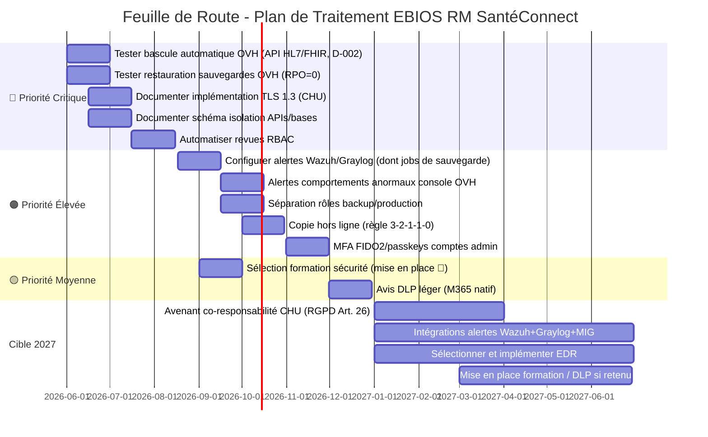

# Synthèse - Clôture de cycle EBIOS RM

> **Document produit dans le cadre du projet portfolio GRC** - [grc-pme-fictive](https://github.com/solenefig-lab/grc-pme-fictive)   
> Ce document est une synthèse pédagogique. Il ne se substitue pas à un audit réalisé par un organisme accrédité. Le niveau de granularité illustre une cible de maturité, non l'état courant du marché TPE/PME santé.  
> Ce document illustre comment une PME e-santé peut aligner sa gestion des risques sur ses enjeux métiers (conformité RGPD/HDS, résilience opérationnelle) avec des ressources limitées.
>
> *Note méthodologique : ce portfolio est un livrable pédagogique figé à la date de remise, chaque semaine documentant l'état des analyses à son moment. En conditions réelles, les documents antérieurs (plan de traitement ISO 27001 S3, PRA/PCA et plan d'action NIS2 S4) seraient mis à jour pour intégrer les résultats de l'analyse EBIOS RM (nouvelles mesures, cotations révisées, écarts rebaptisés).*

---

Ce livrable ne reprend pas la structure formelle du cinquième atelier de la méthode EBIOS RM, à savoir mesures de sécurité priorisées, plan d'action et cadre de suivi, 
les livrables [S3 - ISO 27001](../semaine-3-iso27001/README.md) et [S4 - NIS2](../semaine-4-nis2/README.md) couvrant déjà ces éléments. 
Il reste fidèle à l'esprit du livrable de clôture de cycle, en consolidant les apports différenciants suivants :
- La traçabilité complète : Valeur Métiers VM1/VM2 → Couple Source de Risque et Objectif Visé SR/OV → scénarios stratégiques → scénario opérationnel → mesures → plan d'action.  
- Le delta entre l'analyse EBIOS RM et le Plan de Traitement des Risques PTR en Semaine 3 - ISO 27001.  
- Le delta entre les mesures priorisées issues de l'Atelier 4 EBIOS RM et au Plan d'Action NIS2 en Semaine 4 - NIS2.  
- La décision de traitement du risque S1 : arbitrage documenté avec justification G4×V2.

Dans la logique EBIOS RM, ce document correspond aux **données de sortie consolidées** des 4 ateliers, transformées en plan d'action actionnable.

---

## **Sommaire**

1. [Rappel du périmètre et de la démarche](#1-rappel-du-périmètre-et-de-la-démarche)
2. [Tableau de synthèse des risques](#2-tableau-de-synthèse-des-risques)
3. [Mesures de sécurité retenues et priorisées](#3-mesures-de-sécurité-retenues-et-priorisées)
4. [Risques résiduels](#4-risques-résiduels)
5. [Signatures](#5-signatures)

---

## 1. Rappel du périmètre et de la démarche

Objectif principal : Appliquer une approche de risque systémique (EBIOS RM) à SantéConnect en capitalisant sur les analyses de risque précédentes des semaines 3 et 4 :    
- [Atelier 1 - Cadrage périmètre d'étude et Socle de Sécurité](./1-ebios-rm-santeconnect-cadrage.md) : valeurs métiers, biens supports, parties prenantes, événements redoutés, socle de sécurité existant et écarts résiduels,  
- [Atelier 2 - Sources de Risque](./2-sources-risque.md) : identifier, détailler et prioriser les personnes ou évènements (= Source de Risque, SR) et leurs objectifs (= Objectif Visé, OV), qui pourraient impacter négativement cette mission et ces valeurs métiers,  
- [Atelier 3 - Scénarios stratégiques](./3-scenarios-strategiques.md) : cartographier principaux chemins d'attaque aux parties prenantes et tester la résilience,  
- [Atelier 4 - Scénarios opérationnels](./4-compromission-chu-api.md) : schématiser et évaluer vraisemblance scénario opérationnel de la compromission de l'API du CHU.  

_Note : Anticipation cadre ReCyF (document de travail Référentiel Cyber France de mars 2026 publié par l'ANSSI pour préparer transposition NIS2 en droit français) dans le cadre du partenariat avec CHU Fictif._

---

## 2. Tableau de synthèse des risques

### 2.1 Tableau de synthèse des 3 scénarii stratégiques critiques

| ID | Scénario | Gravité | Vraisemblance | Niveau de risque | Décision de traitement | 
| -- |------------ | ------- | ------- | ------- | ------- | 
| S1 | Compromission de l’API HL7/FHIR via le CHU Fictif | Critique (G4) | V2 - Modérée | 🔴 Haut | **Traiter** |
| S2 | Ransomware sur la base D-002 (dossier médical) via l’hébergeur OVH | Critique (G4) | V2 - Modérée | 🔴 Haut | **Traiter** | 
| S3 | Sabotage interne dispositif sauvegarde | Critique (G4) | V1 - Faible | 🟠 Modéré | **Traiter**  |

**S1: Compromission de l’API HL7/FHIR via le CHU Fictif**  
Ce scénario est aligné sur les attaques récentes contre les CHU et prestataires de santé. Il est développé dans [l'Atelier 4](./4-compromission-chu-api.md).

**S2: Ransomware sur la base D-002 (dossier médical) via l’hébergeur OVH**  
L'organisation criminelle rend indisponible les données via chiffrement et demande une rançon. 

- Chemin d'attaque court (~5 étapes) : phishing Equipe Technique → contournement MFA → Usurpation identité console OVH → chiffrement données médicales → extorsion. 
- Gravité Critique (G4) : indisponibilité base données médicales D-002 > 24h pour SantéConnect dont c'est la valeur métier principale (plateforme de suivi patients cardiologiques inopérante, retards de prise en charge éventuels, crédibilité du dispositif en test détruite); restauration possible via WORM et données sources disponibles par les canaux habituels côté CHU (continuité de soins non menacée), mais perte de l'agrégation des données et du service ; faible incitation à payer (données existant par ailleurs) ; risque résiduel de confidentialité en cas d'exfiltration (notification CNIL/RGPD).  
- Vraisemblance V2 - Modérée : motivation d'extorsion financière réduite pour cette cible (SantéConnect, structure de petite taille à faible capacité de rançon, données sources disponibles par ailleurs) ; surface sociale restreinte (petite équipe technique proche du CEO et du product owner, a priori moins exposée au phishing de masse) ; malgré des contrôles existants faibles (écarts de socle) et un chemin d'attaque court, la probabilité de succès de bout en bout reste modérée, le ransomware étant par ailleurs en recul dans le secteur santé en 2025 (−30 %, source : https://cyberveille.esante.gouv.fr/lobservatoire-des-incidents).  
- Ecarts du socle de sécurité : formations non priorisées, surveillance non automatisée, absence DLP (Data Loss Prevention).

**S3 : Sabotage interne du dispositif de sauvegarde/restauration**  
Un membre de l'équipe technique décide de saboter intentionnellement SantéConnect en neutralisant sa capacité à restaurer son SI.

- Chemin d'attaque court (~5 étapes) : accès admin console OVH → neutralisation des mécanismes de sauvegarde (arrêt silencieux des jobs, plus aucun nouveau point de restauration) → érosion de la capacité de restauration (les sauvegardes WORM existantes restent protégées mais expirent progressivement en fin de rétention) → destruction du SI de production (instances, configurations, IAM) → restauration insuffisante ou impossible en l'absence de copie indépendante hors ligne.  
- Gravité Critique (G4) : perte de données prolongée impactant la restauration du SI de SantéConnect ; les données sources restent disponibles côté CHU/médecins/laboratoires (continuité de soins non menacée).
- Vraisemblance V1 - Faible : motivation forte nécessaire du saboteur (grief, coercition) et chemin d'attaque présupposant une certaine patience (attendre l'expiration des rétentions et supposer non mise en place automatisation détection) ; les sauvegardes WORM verrouillées ne peuvent pas être supprimées, y compris par un administrateur (Object Lock OVHcloud : refus de toute suppression jusqu'à expiration de la rétention, identifiants admin valides compris) ;
- Écarts du socle de sécurité : revues RBAC non automatisées, surveillance continue non formalisée et absence de test de restauration périodique .

PP impliquée : Equipe Technique → Vecteur d'entrée via abus de droits

_Note : pour S2 et S3, la vraisemblance est évaluée de manière globale (intégrant motivation de la source, contrôles existants et surface d'exposition) et la cotation serait à affiner lors d'ateliers opérationnels dédiés , seul S1 ayant fait l'objet d'un scénario opérationnel détaillé (Atelier 4)._

### 2.2 Echelles de cotation

**Cotation de la gravité de l'impact**

| Echelle | Conséquences | Seuil de déclenchement |
| --- | --------- | --------- |
| G4 -  Critique | La survie de la société est menacée. | Indisponibilité de services critiques (dossier médical) > 24h (proche du RTO de 72h); RGPD/HDS : Toute fuite de données de santé ou falsification dès le premier patient = sanction maximale; NIS2 : Les incidents impactant la supply chain (CHU) doivent être notifiés sous 24h (Art. 23). | 
| G3 - Grave | La société va devoir fonctionner en mode très dégradé pour surmonter l'impact. | Indisponibilité coffre-fort > 24h; Falsification > 1 patient ou 1 praticien |
| G2 - Significative | La société va rencontrer quelques difficultés. | Indisponibilité messagerie (autres canaux disponibles) > 24h ; Fuite de données (hors médical) > 2 patients; perte traçabilité > 1 patient ou praticien |
| G1 - Mineure | Aucun impact opérationnel sur les performances ou la sécurité des biens et des personnes. | - |

**Cotation de la vraisemblance**

| Gradation vraisemblance | Description |
| --- | -------------- |
| V4 | Probabilité de réussite très élevée en utilisant l'un des modes opératoires envisagés ( > 90 %) |
| V3 | Elevée : réussite probable (> 60 %) |
| V2 | Modérée : le risque de réussite de l'attaque existe ( > 20%) |
| V1 | Peu probable : risque faible |

La vraisemblance couplée à la gravité est un indicateur d'estimation de niveau de risque, pour prioriser la stratégie du traitement du risque. Elle n'est pas une prédiction que l'attaque va arriver, mais de sa réussite si la SR attaquait.

**Critères d'acceptabilité des risques de sécurité de l'information**

| Niveau | Score (Gravité × Vraisemblance) | Seuil d'acceptation |
|--------|------------------------------|-------------------|
| 🟢 Faible | 1 – 2 | Risque acceptable (surveillance): impact faible (ex : fuite de données non sensibles) ou probabilité faible (ex : attaque ciblée improbable) |
| 🟠 Modéré | 3 – 5 | Risque acceptable sous conditions (mesures compensatoires) |
| 🔴 Haut | 6 – 9 | Risque inacceptable (à traiter en priorité): impact critique (ex : sanction RGPD, perte de données médicales) ou probabilité élevée (ex : accès non contrôlé).|

Pour la gestion des risques, la norme ISO 27001 décrit quatre actions possibles : 
- **Traiter** le risque avec des contrôles de sécurité qui réduisent la probabilité qu'il se produise 
- **Éviter** le risque en empêchant les circonstances où il pourrait se produire 
- **Transférer** le risque avec un tiers (c'est-à-dire, externaliser les efforts de sécurité à une autre entreprise, souscrire une assurance, etc.) 
- **Accepter** le risque car le coût d'y remédier est supérieur aux dommages potentiels 

---

## 3. Mesures de sécurité retenues et priorisées

Les mesures prioritaires ciblent en premier lieu la résilience, les accès privilégiés, la sécurisation des interconnexions et la détection. 
Les actions déjà inscrites au [Plan de Traitement des Risques](../semaine-3-iso27001/plan-traitement-risques.md), [PRA/PCA](../semaine-4-nis2/pra-pca.md) et [Plan d’action NIS2](../semaine-4-nis2/plan_action_nis2.md) sont référencées plutôt que dupliquées, leur avancement et leurs preuves de mise en œuvre sont suivis dans ces plans.
Les mesures non prioritaires ou présentant un risque résiduel acceptable restent sous surveillance.

| Priorité | Mesure de sécurité | Risques (scénarios) | ISO 27001:2022 | Écart NIS2 associé | Responsable | Échéance / Statut | Documentation |
| --- | --- | --- | --- | --- | --- | --- | --- |
| 🔴 Critique | Tester bascule automatique sur le serveur de secours OVH (script Python) pour les services critiques (API HL7/FHIR, Base D-002) | S1, S2, S3  | A.5.30, A.8.13    | PCA/PRA non documenté  | RSSI    | ✅ 30/06/2026 | Scripts Python, Rapport de test, PRA/PCA mis à jour |
| 🔴 Critique | Tester restauration depuis les sauvegardes OVH (RPO = 0 pour la Base D-002) | S1, S2, S3  | A.5.30, A.8.13    | PCA/PRA non documenté  | RSSI    | ✅ 30/06/2026 | Rapport de test, PRA/PCA mis à jour |
| 🔴 Critique | Automatiser les revues RBAC | S1, S2, S3   | A.5.9–18, A.8.2–3, A.8.5 | Revues RBAC non automatisées         | DevOps | ✅ 15/08/2026 | Script d'automatisation, Logs |
| 🔴 Critique | Sécuriser les API et l’interconnexion CHU : Documenter implémentation et vérification TLS 1.3   | S1        | A.8.25–30  | Micro-segmentation non documentée    |  DevOps | ✅  15/07/2026 | Schéma réseau |
| 🔴 Critique | Sécuriser les API et l’interconnexion CHU : Documenter schéma isolation des APIs et bases   | S1     | A.8.25–30  | Micro-segmentation non documentée    |  RSSI | ✅  15/07/2026 | Schéma réseau, Caractéristiques Firewall OVH |
| 🟠 Élevée   | Renforcer la détection et la surveillance continue : Configurer des alertes dans Wazuh/Graylog, dont **alerte sur l'arrêt/échec des jobs de sauvegarde**     | S1, S2, S3   | A.5.17, A.8.5, A.8.20    | Surveillance continue non formalisée | RSSI | ✅ 15/09/2026 | Règles Wazuh, Graylog |     
| 🟠 Élevée | **Renforcer la détection : configurer alertes sur les comportements anormaux console OVH** (connexions atypiques, création/suppression de ressources) | S2, S3 | A.8.15, A.8.16 | Surveillance continue non formalisée | DevOps | 🔄 15/10/2026 | Règles d'alerte, Logs OVH |
| 🟠 Élevée | **Gestion des comptes privilégiés : séparation des rôles backup/production** | S3 | A.5.3, A.8.2, A.8.5 | Revues RBAC non automatisées | DevOps | 🔄 15/10/2026 | Matrice RBAC, Comptes nominatifs |
| 🟠 Élevée   | **Renforcer PCA/PRA : Copie hors ligne additionnelle (règle 3-2-1-1-0)** | S3 | A.8.13 | PCA/PRA non testé | DevOps | 🔄 29/10/2026 | Rapport de test, PRA/PCA mis à jour |
| 🟠 Élevée | **MFA résistant au phishing : clés de sécurité FIDO2/passkeys sur les comptes d'administration (console OVH, messagerie)** | S2 | A.5.17, A.8.5 | Surveillance continue non formalisée | RSSI | 🔄 30/11/2026 | Inventaire clés, Politique MFA, Test de connexion |
| 🟡 Moyenne  | **Renforcer l'accord de co-responsabilité (RGPD Art. 26) : clauses réciproques de notification d'incident sous 24h et engagement de correction des vulnérabilités API ; documentation du mode dégradé** | S1 | A.5.31, A.5.22, A.5.29–30 | PRA/PCA non documenté, clause contractuelle co-responsable non documenté | RSSI | 🔄 2027 | Clause de co-responsabilité CHU |
| 🟡 Moyenne  | Automatiser les alertes et améliorer les intégrations entre les différents outils (Wazuh + Graylog + MIG) | S1, S2, S3   | A.5.17, A.8.5, A.8.20    | Surveillance continue non formalisée | RSSI | 🎯 cible 2027 | Règles, Processus d'escalade |
| 🟡 Moyenne  | Renforcer sensibilisation et formation sécurité | S2, S3    | A.6.3   | Preuves de formation NIS2 manquantes | RH   | ✅ 30/09/2026 (sélection), 🎯 (mise en place) | Appel d'offre, Contrat, PV de formation |
| 🟡 Moyenne  | Sélectionner et implémenter un EDR (Endpoint Detection and Response) | S1, S2, S3 | A.8.7 | Surveillance continue non formalisée |RSSI | 🎯 cible 2027 | Appel d'offre, Contrat, PRA/PCA |
| 🟡 Moyenne  | **Évaluer la pertinence d'un DLP léger (filtrage messagerie/DLP natif Microsoft 365) avant acquisition** | S2| A.8.12 | Absence DLP | RSSI | 🔄 avis 31/12/2026, 2027 si retenu | Note d'arbitrage |

**Légende**
✅  : Mesures de sécurité priorisées dans les précédentes analyses de risques et aux échéances maintenues
🔄 : Mesures de sécurité priorisées ajoutées ou renforcées suite à analyse EBIOS RM
🎯 : Mesures de sécurité planifiées dans les précédentes analyses de risques

_Note :_  
_- La formation est maintenue en priorité moyenne, l'équipe réduite (15 pers.) bénéficiant d'une sensibilisation informelle par proximité (RSSI/DevOps), et les mesures techniques de haute priorité (MFA FIDO2, alertes) réduisent la dépendance au facteur humain en attendant le déploiement formel 2026-2027._  

---

## 4. Risques résiduels

Après mises en place des mesures de sécurité priorisées, aucun risque résiduel ne descend sous G3 car lié à la valeur métier (données de santé, dispositif en test). 
Les trois résiduels sont acceptés sous conditions et consignés au registre des risques résiduels (ISO 27001 A.5.4), avec critères de revue : effectif > 25 personnes, sous-traitance de l'administration, levée de fonds (capacité de rançon), non-renouvellement de la copie hors ligne.

| Scénario | Cotation initiale (Gravité x Vraisemblance) | Mesures de réduction | Cotation résiduelle | Risque résiduel |
| --- | --- | --- | --- | --- |
| **S1 · Compromission API HL7/FHIR (CHU)** | 🔴 Haut (G4 × V2) | Clause contractuelle sécurité renforcée, PRA/PCA testé et documenté, TLS 1.3 vérifié, Micro-segmentation documentée, Alertes Wazuh/Graylog | 🟠 Modéré (G3 x V1) | Baisse de vraisemblance sous réserve de l'avenant contractuel (2027), à défaut, la vraisemblance résiduelle demeure V2; **Dépendance CHU** : API tierce non maîtrisée (patching, configuration), risque partiellement transféré (contrat), jamais éliminé |
| **S2 · Ransomware base D-002 (OVH)** | 🔴 Haut (G4 × V2) | MFA FIDO2 (comptes admin), Sauvegardes WORM testées, Alertes console OVH, Tests PCA/PRA | 🟠 Modéré  (G3 × V1) | **Fenêtre de déploiement 2026** (mesures non encore effectives) · **Pas d'EDR ni DLP avant 2027** (exfiltration silencieuse non détectée) |
| **S3 · Sabotage interne sauvegarde/restauration** | 🟠 Modéré (G4 x V1) | Alerte sur arrêt/échec des jobs de sauvegarde · Séparation rôles backup/production · Copie hors ligne (3-2-1-1-0) · Test de restauration périodique | 🟠 Modéré (G4 x V1)| Actions légitimes, lentes, en fenêtres de maintenance; gravité incompressible, vraisemblance déjà V1 |

_Note sur S3 :_  
_- La cotation résiduelle à date est semblable à l'initiale : la destruction du SI reste critique et les mesures réduisent la probabilité de succès et améliorent la capacité de reprise, sans modifier l'impact potentiel._  
_- Après mise en œuvre effective de la copie hors ligne (29/10/2026) et des tests de restauration trimestriels, la gravité pourrait basculer en G3 (restauration dégradée possible), avec revue de cotation confiée à la RSSI au premier test de restauration trimestriel (T1 2027)._

---

## 5. Signatures

La direction de SantéConnect, par les signatures ci-dessous, valide le plan de traitement des risques et les priorités retenus (sections 3 et 4), approuve l'acceptation des risques résiduels documentés et alloue les ressources nécessaires à leur mise en œuvre. 
Les cotations résiduelles feront l'objet d'une revue lors du premier test de restauration trimestriel (T1 2027).
Prochaine revue du document : T1 2027 (après test restauration). Responsable : RSSI.

| Rôle | Nom | Version | Date | 
| ----- | ----- | ----- |  ----- | 
| CEO - validation | Martin DUPONT | V1.0 | 07/10/2026 |
| RSSI | Claire ESPINOZA | V1.0 | 07/10/2026 |
| DevProduit | Stéphane ROY | V1.0 | 07/10/2026 |
| DPO - relecture | Jeanne PETIT | V1.0 | 07/10/2026  |

---

*Document produit dans le cadre du projet portfolio GRC - [github.com/solenefig-lab/grc-pme-fictive](https://github.com/solenefig-lab/grc-pme-fictive)*
*Ce document est une synthèse pédagogique. Il ne se substitue pas à un audit réalisé par un organisme accrédité.*

---
