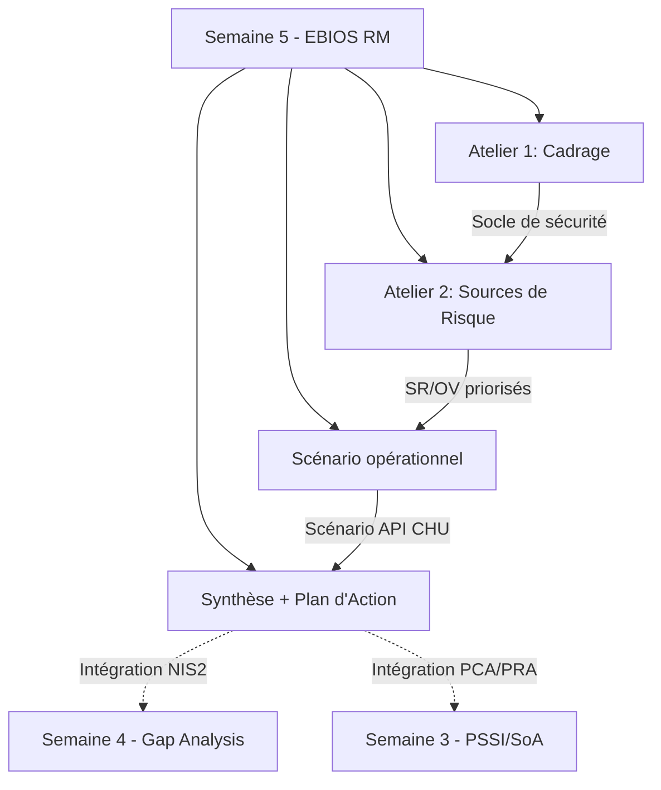

## Semaine 5 - EBIOS Risk Manager - Cadrage et appréciation des risques

### Objectif

**Formaliser l'approche EBIOS Risk Manager** (ANSSI) pour SantéConnect, en capitalisant sur les analyses de risques précédentes ([PTR](../semaine-3-iso27001/plan-traitement-risques.md), [SoA](../semaine-3-iso27001/SoA.md), [Analyse impact NIS2](../semaine-4-nis2/analyse-impact-nis2.md)), et passer d’une approche conformité (S1-S4) à une **approche risque systémique** (EBIOS RM) :

- **Cadrer le périmètre d'étude** (valeurs métiers, biens supports, parties prenantes, événements redoutés).
- **Établir le socle de sécurité existant et ses écarts résiduels**, base de l'appréciation des risques.
- **Construire un scénario opérationnel** (compromission API CHU) illustrant la logique attaquant, complémentaire à l'approche conformité menée jusqu'ici.

_Note : Pourquoi avoir choisi ce scénario (compromission API CHU) ?_
_- Impact maximal : Fuite de données médicales sensibles → sanction RGPD (4% CA) + perte de confiance des patients._
_- Lien avec les gaps S4 : Micro-segmentation non doculentée, surveillance continue non formalisée._ 
_- Fournisseur d'une entité essentielle : Le CHU est un partenaire NIS2 (Art. 21) → obligation de notification sous 24h en cas d’incident._  

---

### Livrables
| Livrable | Description | Statut |
|---|---|---|
| [`1-ebios-rm-santeconnect-cadrage.md`](./1-ebios-rm-santeconnect-cadrage.md)| Atelier 1 — Cadrage et socle de sécurité : périmètre métier/technique, valeurs métiers, parties prenantes, événements redoutés cotés (échelle G1-G4), socle de sécurité actualisé (SoA + plan d'action NIS2). | ✅ Complet |
| [`2-sources-risque.md`](./2-sources-risque.md) | Atelier 2 — Sources de risque : cartographie sources de risque (SR) et objectifs visés (OV), couple SR/OV priorisé (CHU, OVH, RBAC). | 🔄 En cours |
| `ebios-rm-santeconnect-scenario-compromission-api.md` | Cadrage stratégique intégré (sources de risque, vecteur CHU/OVH/RBAC), suivi de la compromission de l'API HL7/FHIR via supply chain CHU - modes opératoires techniques détaillés. | 🔜 A venir |
| `ebios-rm-santeconnect-synthese.md` | Synthèse et plan d'action : risques résiduels priorisés, alignement avec le plan d'action NIS2 (S4). |🔜 A venir|

---

### Points méthodologiques clés

- **Réutilisation du socle existant** : conformément au guide EBIOS RM (étape "socle de sécurité"), les contrôles déjà mis en œuvre (SoA S3, plan d'action NIS2 S4, PCA/PRA S4) constituent la base éprouvée dans les ateliers d'appréciation — pas de redondance, mais actualisation continue.
- **Double échelle de gravité** : la grille 3×3 (PTR, S3) reste l'outil de cotation des risques globaux; EBIOS RM introduit une échelle à 4 niveaux (G1-G4) pour les événements redoutés, avec seuils de déclenchement explicites ancrés sur le RTO 72h, le RPO 24h et les délais NIS2 (Art. 23).
- **Posture méthodologique** : Atelier 1-3 simplifiés et ciblés (PME 15 personnes), option scénario opérationnel unique retenue pour l'atelier 4-5; pertinence et lisibilité du portfolio priorisées sur l'exhaustivité.
- **Contexte réglementaire anticipé** : transposition NIS2 française non publiée à ce jour ; le Référentiel Cyber France (ReCyF, ANSSI, 17/03/2026) est retenu comme référentiel cible anticipé.

---

## Prochaine étape

La Semaine 5 clôture le cycle d'analyse de risques EBIOS RM avec un plan d'action priorisé, intégré aux livrables NIS2 (S4).

_Note : cette section "Prochaine étape" est conservée à chaque semaine du portfolio pour matérialiser la timeline et la montée en compétences progressive du projet; elle n'est pas mise à jour rétroactivement._

Semaine 6 (envisagée): Opportunité à l'international (Export méthodologique)
Tester la portabilité de la démarche GRC construite sur SantéConnect (RGPD-HDS, ISO 27001, NIS2, EBIOS RM) face à un référentiel international, type NIST CSF.

